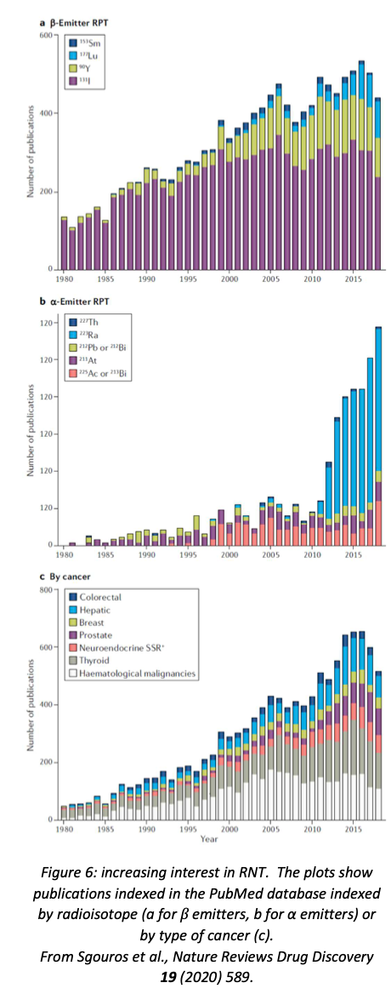

## Nuclear Medicine

### Radiation in the body
This part of the course is about the application of radioactivity to medicine, both for imaging (**diagnostic nuclear medicine**) and for treatment (**therapeutic nuclear medicine**).  Radioactivity is also a natural feature of the environment: uranium, thorium and potassium-40 are present in many minerals, and cosmogenic carbon-14 is a natural feature of the atmosphere (albeit somewhat augmented since 1945 by carbon-14 from nuclear bomb tests).  However, there is no doubt that ionising radiation in excess is not good for you, so we should start by reviewing the measurement of radiation exposure (known as **dosimetry**).

#### Units
 The basic SI unit of absorbed dose is the **gray** (Gy); 1 Gy = 1 J kg$^{−1}$.  However, different types of radiation do different amounts of damage, so for biological applications this is multiplied by a **quality factor** which depends on the type of radiation (see Table 1).  The quality factor is determined by the energy deposited per unit distance travelled; fairly obviously, more damage will be done if the energy deposit is more concentrated.  The product of the dose and the quality factor is known as the **dose equivalent** and is measured in **sieverts** (Sv).  The quality factor is dimensionless, so the sievert is also equivalent to J kg$^{−1}$.

:::{figure-md} qualitytable

:::

The average radiation exposure of a member of the public (i.e. not a radiation worker) in the UK is 2.7 mSv/yr, mostly from background radiation but also including medical exposure such as dental X-rays.  It is noticeably higher if you live on granite (adds about 0.3 mSv/yr) or do a lot of flying (adds 5 μSv/hr, because of higher cosmic-ray flux; negligible for leisure travellers, but significant for aircrew).

#### Legal limits
The legal limits in the UK are set by the Ionising Radiations Regulations 2017, and can be summarised as follows:
- Member of public: 1 mSv/yr;
- Radiation worker under 18: 6 mSv/yr;
- Radiation worker over 18: 20 mSv/yr;
- If pregnant: 1 mSv to foetus over duration of pregnancy (after employer notified).

In addition to this, there are specific limits on particular organs (eye, skin, etc.).

#### Content of this unit
Ionising radiation includes X-rays, and X-rays are certainly the most common form of “radiation” encountered in a medical context.  However, medical X-rays are generated using accelerated electrons, and therefore don’t qualify as “nuclear”.

MRI scanners definitely make use of nuclear properties (the phenomenon is known as “nuclear magnetic resonance”, but when it was utilised for medical imaging the ‘nuclear’ was omitted in case it frightened the patients!).  The principle of MRI is that the strong magnetic field in the scanner aligns the proton spins; this alignment is then perturbed by a radio-frequency pulse, which causes the spin to precess around the magnetic field, and this precession is then detected by a receiving coil.  Medical MRI scanners are tuned to excite hydrogen, and therefore map hydrogen-rich material (mostly water and fat).  However, the interesting aspects of MRI are the magnet and the RF system, neither of which is dependent on the nuclear physics, so we won’t discuss MRI any further.

The rest of this unit is therefore devoted to the use of artificial radioisotopes in medicine, both for imaging and for treatment, primarily of cancer.  This is itself a very large topic, and we will only be able to give a summary here.  People interested in the clinical details may wish to consult the book *Nuclear Medicine* by WD Leslie, available as an ebook from the University Library.  

### Medical radioisotopes
#### Requirements
To be suitable for use in diagnostic imaging, a medical radioisotope needs to be:
- a β$^{+}$ or γ emitter, since only γ rays are likely to exit the body so that they can be detected by the imaging device (in the case of β$^{+}$ emitters, the γ rays are produced when the positron annihilates with an electron, which it will do very close to its point of production);
- capable of being incorporated into a biologically relevant **tracer molecule** which will be taken up by the imaging target (for example, the thyroid takes up iodine, so to image the thyroid one would incorporate a suitable isotope of iodine into a biologically accessible molecule;
- not toxic (either itself or its decay product);
fairly short-lived (hours to days), so that it is quickly cleared from the patient;
- active enough to produce a detectable signal (this is normally implied by the short life).

The requirements for therapeutic radioisotopes depend on whether the source is **sealed** (i.e. contained within some bead, wire, capsule, etc.) or **unsealed** (i.e. released into the body as a biologically active molecule).  Unsealed sources have similar requirements to diagnostic sources, except that they will usually be β emitters, since in this case we want them to deposit their energy close to the decay point instead of exiting the body to be detected externally.  Sealed sources have less stringent requirements, since they are mechanically inserted at the desired location (so they don’t have to be incorporated into biologically active molecules) and removed when the appropriate dose has been reached (so toxicity is less of an issue).

#### Production of medical radioisotopes
Naturally occurring radioactive isotopes are unlikely to satisfy the above requirements, so we need to be able to manufacture appropriate isotopes.  There are two principal methods: reactors and accelerators.
##### Reactors
Radioisotopes can be produced by exposing an appropriate target material in a research reactor.  The target will be bombarded mostly with thermal neutrons. This tends to produce neutron-rich isotopes.  In some cases, the isotope itself or its parent is a fission product and is produced by exposing a uranium target; in other cases, a suitable parent isotope is irradiated.  Targets usually have to be isotopically enriched to produce a sufficiently high yield and avoid additional unwanted isotopes.

The number of research reactors producing medical radioisotopes is quite small, so reactor-produced isotopes tend to have longer half-lives (just because they have to retain useful activity after they have been transported from the reactor to the hospital).

##### Accelerators

The best choice of accelerator for radioisotope production is a **proton cyclotron**.  Cyclotrons produce low-energy beams, appropriate for radionuclide production since you probably want a compound-nucleus reaction rather than direct scattering.

:::{figure-md} cyclotronschematic

:::

The basic layout of a cyclotron is shown in Figure 1.  The protons are injected in the centre, spiral outwards as they are accelerated by an alternating electric field timed so that the protons see an accelerating voltage whenever they cross the gap between the two D-shaped electrodes, and are finally directed on to the target material.  Cyclotrons are fairly compact devices, and there are somewhere of the order of 1300 medical cyclotrons around the world (there is one in Dinnington, just outside Sheffield).  This is useful, because some of the isotopes produced in cyclotrons, especially those used for PET scanners, have very short half-lives, so the production site needs to be close to the hospital.

Cyclotrons generally produce the more proton-rich medical isotopes, but cyclotron production routes are being developed as alternatives for traditionally reactor-produced nuclides, because of the large number of cyclotrons compared to the relatively small number of research reactors.

##### Generators
Sometimes the isotope of interest is not produced directly, but is the result of the β decay of a radioactive parent.  If the lifetime of the parent is much longer than that of the daughter, a generator system can be used to produce the daughter on-site.  By far the most important such isotope is $^{99m}$Tc, a metastable state of technetium produced by the decay of $^{99}$Mo.  Molybdenum-99 is a fission product with a half-life of 66 hours; $^{99m}$Tc, on the other hand, has a half-life of only 6 hours.

A generator is essentially a shielded vial, initially containing the parent isotope.  A solvent is injected to wash out (*elute*) the daughter.  This process can be repeated several times, with decreasing yield each time as the parent decays.  A schematic diagram of a generator is shown in figure 2.

Generator systems allow short-lived radionuclides to be used at hospitals which are some distance from the nearest production facility.  Unfortunately they are only feasible in the particular case where a short-lived medical isotope is produced by the decay of a longer-lived precursor, which of course is not generally true.  However, $^{99m}$Tc is the single most widely used medical isotope, so it is worth mentioning generator systems for that reason.

### Some common medical radioisotopes
This is an abridged list—the number of radioisotopes with medical applications is extremely large.  For more information, see the *World Nuclear Association website*.

#### Diagnostic isotopes
The ideal diagnostic isotope would produce γ rays (for scintigraphy and SPECT) or positrons (for PET) and nothing else.  Therefore, electron-capture isotopes are preferred as γ emitters (no electron emission).  Both EC isotopes and positron emitters are proton-rich, so production is mostly by cyclotrons (the exception is $^{99m}$Tc, which is produced by β decay of a fission product and itself decays by isomeric transition; the ground state, $^{99}$Tc, is a β$^{−}$ emitter but has a very long half-life, so very low activity at imaging doses).

##### γ emitters for scintigraphy and SPECT
- **$^{99m}$Tc** (half-life 6.0 hours; produced at point of use from $^{99}$Mo (66 hr), which is a fission product manufactured by irradiating enriched uranium in a reactor; decays by isomeric transition to the ground state $^{99}$Tc (half-life 211100 years) with emission of 143 keV γ-ray).	*This is by far the most widely used medical radioisotope.  The short half-life minimises patient exposure, and the versatile chemistry of technetium means that it can be incorporated into a wide range of tracer molecules.  A few sample uses are listed below (for more see the NIH National Library of Medicine webpage)*:

  - **sodium pertechnetate**: imaging of brain, thyroid, salivary gland, bladder, nasolacrimal drainage;
  - **$^{99m}$Tc** methylene diphosponate: bone imaging;
  - **$^{99m}$Tc** sestamibi ($^{99m}$Tc-methoxy isobutyl isonitrile): myocardial perfusion (blood flow in heart muscle), parathyroid, breast;
  - **$^{99m}$Tc** exametazine: cerebral blood flow.
  
  <vspace>

  $^{99m}$Tc is so widely used that there are concerns about supply, given that research reactors are few in number and many are now rather old (95% of the supply of $^{99}$Mo comes from seven reactors, one of which is new—the average age of the others is 53 years).  Other production routes, e.g. $^{100}\textnormal{Mo(γ,n)}^{99}$Mo using an electron linac to generate a high-intensity photon beam, are being investigated.
 

- **$^{123}$I** (half-life 13.2 hours; produced by $^{124}$Xe(p,pn)$^{123}$Xe → $^{123}$I or $^{124}$Xe(p,2n)$^{123}$Cs  → $^{123}$Xe → $^{123}$I in cyclotron; decays by electron capture with emission of 159 keV γ).	
  This is used for diagnostic imaging of the thyroid, in the form of NaI.  It has replaced the reactor-generated $^{131}$I for this purpose since it produces a much more intense γ flux but much lower radiation dose to the thyroid tissue.  For exactly this reason, $^{131}$I and not $^{123}$I is used for the treatment of thyroid disease (hyperthyroidism and thyroid cancer).	A different tracer compound, meta-iodobenzylguanidine (MIBG), is used for imaging (with $^{123}$I) or treating (with $^{131}$I) some endocrine tumours.
 

- **$^{201}$Tl** *(half-life 73 hours; produced by $^{203}$Tl(p,3n)$^{201}$Pb → $^{201}$Tl in cyclotron; decays by electron capture, emitting mainly X-rays of energy 67–82 keV from de-excitation of $^{201}$Hg, with 12% γ-ray photons of energies 135 and 167 keV)*
  	Used in the form of $^{201}$TlCl, usually for heart imaging, though it is also useful in distinguishing benign and malignant bone lesions and for post-treatment scans of brain tumours.  It is taken up by the body as a potassium analogue.  For many applications, it has now been replaced by $^{99m}$Tc, because the shorter half-life of $^{99m}$Tc, and the superior γ-ray spectrum, results in a lower radiation dose to the patient.

##### β$^{+}$ emitters for PET  
- **$^{18}$F** *(half-life 110 min; produced in cyclotron by $^{18}$O(p,n)$^{18}$F; decays by positron emission  with a branching ratio of 97%, the other 3% being electron capture)*.	
This is the most important PET isotope.  The main tracer compound is fluorodeoxyglucose, which the body treats as if it were glucose, so it is taken up by rapidly metabolising cells—including cancer cells.  Na$^{18}$F is used for bone imaging.  More recently, florbetaben (an aromatic compound with composition $C_{21}H_{26}~^{18}FNO_{3}$) has been approved for imaging amyloid plaques—diagnostic of Alzheimer’s disease—in the brain.
 
- **$^{11}$C** *(half-life 24 min; $^{14}$N(p,α)$^{11}$C in cyclotron; decays by positron emission with branching ratio 911.8%)*.	
  Carbon is of course the basis of organic chemistry, so $^{11}$C can be incorporated into essentially any organic compound—the limiting factor is the short half-life, which means that the desired compound has to be easy to synthesise quickly.  Common $^{11}$C-labelled tracers include $^{11}$C-flumazenil for studies of epilepsy, $^{11}$C-raclopride for Parkinson’s disease, $^{11}$C-methionine (an amino acid) for a range of cancer diagnoses and $^{11}$C-choline, a precursor to the neurotransmitter acetylcholine, used for diagnosis of brain, lung, oesophagus, colorectal and prostate cancers.
 
- **$^{68}$Ga** *(half-life 68 min; produced on-site from $^{68}$Ge (271 days), which is itself produced in a variety of ways, including $^{69}$Ga(p,2n)$^{68}$Ge and $^{66}$Zn(α,2n)$^{68}$Ge)*.	
  The only PET isotope that can be used in hospitals located a long way from a cyclotron.  The main uses are for diagnosis of prostate cancer using labelled PSMA (prostate specific membrane antigen) as the tracer, and for neuroendocrine tumours using various compounds that mimic the hormone somatostatin.  Particularly useful because it has very similar biochemistry to the therapeutic radioisotope $^{177}$Lu, so one can image with $^{68}$Ga and treat with $^{177}$Lu, confident that the same tissue is targeted in both cases.

#### Therapeutic isotopes
The requirements for therapeutic use are almost opposite to diagnosis: this time the aim is to deposit the energy produced by the decay as locally as possible.  They also tend to have longer half-lives, since we want to irradiate the surrounding tissue (in contrast to imaging where the aim is to minimise the radiation dose to the patient).  Most therapeutic isotopes are β$^{−}$ emitters, though in some cases the therapeutic agents are X-rays or low-energy γ-rays.  β$^{−}$ emitters are neutron-rich, so most of these isotopes are produced in reactors.
Therapeutic isotopes can be mechanically inserted (brachytherapy) or introduced as biologically active molecules (radionuclide therapy).

##### Brachytherapy isotopes
- $^{192}$Ir (half-life 73.8 days; produced by $^{191}$Ir(n,γ)$^{192}$Ir in reactor; decays by β$^{−}$ to $^{192}$Pt (95.6%; remaining 4.4% by electron capture to 192Os) plus a wide range of de-excitation γ-rays from 0.136 to 1.06 MeV).	Used to treat head and neck cancers, prostate and cervical cancer.
- $^{125}$I (half-life 511.4 days; produced by $^{124}$Xe(n,γ)$^{125}$Xe → $^{125}$I in reactor; decays by electron capture to $^{125}$Te with emission of soft γ rays (up to 35 keV) and internal-conversion electrons (also 35 keV)).	Wide range of applications in cancer therapy; particularly useful because the very low energy of the γ-rays and IC electrons minimises the dose to tissue surrounding the targeted tumour.
- $^{90}$Y (half-life 64 hours; produced by decay of fission product $^{90}$Sr or by (n,γ) on $^{89}$Y; decays by β$^{−}$ to $^{90}$Zr).	Used in the form of microspheres to treat liver cancer; can also be used to treat synovitis (inflammation of the synovial membrane in a joint) because it damps down the inflammation.

##### Radionuclide therapy isotopes
- $^{89}$Sr (half-life 50.5 days; produced by (n,γ) on $^{88}$Sr; decays by β$^{−}$ to $^{89}$Y).	Used for relief of pain caused by bone tumours (does also reduce tumour size).  Taken up by bone because it is a calcium analogue.  $^{153}$Sm is also used for this purpose.

- $^{188}$Re (half-life 17 hours; produced on-site from $^{188}$W, which is produced by double neutron capture on $^{186}$W; decays by β$^{−}$ to $^{188}$Os, with 15\% 155 keV γ emission, useful for imaging)	Another isotope useful for pain relief in bone cancer; can also be used for brachytherapy of liver tumours similarly to $^{90}$Y.

- $^{177}$Lu (half-life 6.7 days; produced by $^{176}$Lu(n,γ)$^{177}$Lu or $^{176}$Yb(n,γ)$^{177}$Yb → $^{177}$Lu; decays by β$^{−}$ to $^{177}$Hf, with significant emission of 208 and 113 keV γ rays suitable for imaging).	Used in the form of a somatostatin analogue for neuroendocrine tumours; also recently approved for prostate cancer treatment using $^{177}$Lu-PSMA.

### Diagnostic nuclear medicine: imaging
#### Imaging instrumentation
In order to use radioisotopes for imaging, we have to be able to detect the γ rays that they emit.  The instrument that does this is known, unsurprisingly, as a **gamma camera**.	 

A typical gamma camera uses scintillator to convert the γ-ray photons into visible light, which is then read out by photomultiplier tubes.  The usual choice of scintillator is NaI(Tl), which has good photon yield, is readily available and is well understood.  To provide spatial resolution, a collimator (essentially a lead sheet pierced with an array of small holes) is placed in front of the scintillator so that only normally incident photons are detected.  This does not completely solve the problem, because scintillation light is itself emitted isotropically, so light from one location will be picked up by a number of PMTs; however, the amount of light detected will decrease with distance from the source, so the position can be determined by finding the peak of the light distribution.  The amount of light is proportional to the energy of the incident γ ray.

This is not an ideal system.  The collimator absorbs most of the photons, and the scintillator has to be relatively thin (thus reducing its efficiency) to optimise spatial resolution, which is still poor compared to CT or MRI.  Many modern scanners, especially PET scanners, have coordinated gamma cameras and CT scanners, so that the higher spatial resolution of the CT scan can be correlated with the greater selectivity of the radioisotope imaging.  This is harder to do with MRI, because MRI requires high magnetic fields and PMTs do not work in magnetic fields; partly for this reason, work is being done on replacing the traditional PMT array with solid-state detectors such as avalanche photodiodes.  Recently some SPECT scanners have replaced the scintillator-plus-PMT combination with solid-state cadmium-zinc-telluride (CZT) detectors.

#### Scintigraphy
Scintigraphy is the simplest form of radionuclide imaging: a single camera scans the patient, providing a two-dimensional projection of the γ emission, analogous to a standard X-ray image.  The patient is injected with or consumes (depending on application) the radioisotope-labelled compound, waits for the time required to allow the compound to be taken up by the relevant tissues, and is then scanned.  Applications include bone scans, studies of the digestive system (for digestive transit time and for diagnosing bleeding, lung scintigraphy (using a gaseous tracer), and evaluation of thyroid function (using $^{123}$I; in this case the key question is not where the tracer is absorbed but *how much* is absorbed).  An example of a bone scan using $^{99m}$Tc-methylene-diphosphonate as tracer is shown in figure 3.

The main disadvantage of scintigraphy is the lack of spatial resolution: the combination of inherently poor resolution of gamma cameras (typically of order 1 cm) with the 2D projection means that it may be hard to locate small tumours with adequate precision.  

#### SPECT
SPECT (Single Photon Emission Computed Tomography) is to scintigraphy as CT scans are to X-rays: instead of one camera scanning the body in a fixed orientation, two cameras are mounted on a circular gantry and rotated, producing a large number of images from different angles which are then analysed by computer to produce a 3D image.  Many modern scanners combine SPECT with a conventional CT scan, which makes it much easier to visualise and locate anatomically any regions that show up on the SPECT scan.

The ideal radioisotopes for use with SPECT emit monoenergetic γ rays with energies between 100 and 200 keV. $^{99m}$Tc and $^{123}$I are well suited to this technique, and many other isotopes can also be used.  An example of a SPECT/CT image is shown in figure 4.

SPECT/CT scanners are obviously more expensive than pure SPECT scanners, but provide a better patient experience (only one scan instead of two) and better localisation of disease (important to optimise treatment, especially surgery.  The CT scan also improves the SPECT resolution by improving the attenuation correction for the γ ray intensity.  Although PET scans offer intrinsically higher resolution than SPECT alone, the improvements offered by SPECT/CT narrow the gap, which is particularly valuable in cases where there is no suitable PET radioisotope available (e.g. iodine).

#### PET
Positron emission tomography (PET), as the name indicates, uses positron emitters rather than γ emitters as the γ ray source.  The positron will rapidly (i.e. very close to its point of production) annihilate with an electron to produce two nearly back-to-back 511 keV photons, which escape and are detected.

Because the aim is to detect both photons in coincidence, a rotating camera of the type used in SPECT (or CT) imaging is not suitable.  Instead, PET scanners have a fixed ring of scintillator to maximise acceptance for multiple photons.  NaI(Tl) is not well suited to 511 keV photons, and PET scanners use more exotic scintillators: the most common are bismuth germanate (BGO), cerium-doped lutetium oxyorthosilicate (LSO:Ce) and cerium-doped lutetium yttrium oxyorthosilicate (LYSO:Ce).  The latter two are newer than BGO, and are preferred because they have higher photon yield and faster response, which decreases background from random coincidences of unrelated photons.  In a typical PET scanner, each scintillator block is actually made from a large number of optically isolated small crystals, which improves spatial resolution: PET scanners typically have a resolution of a few mm, significantly better than SPECT.  Each pair of photons defines a line of response, on which the point of emission should lie; these lines of response are then combined by dedicated software to produce the final image.  As with SPECT, PET/CT combined scanners improve image quality by making use of the CT scan to correct for attenuation of γ rays and make it easier to localise the regions of interest: modern PET scanners all incorporate CT (as far as I can see).

The main limitation of PET scanners is that the range of isotopes available is much more limited than for SPECT, and most of them have short half-lives, which means that the hospital needs to be located close to an appropriate production facility (usually a cyclotron).  The most commonly used PET isotope is $^{18}$F, which has a half-life of 110 minutes; the most common tracer molecule is $^{18}$F-FDG (fluorodeoxyglucose), which biological systems take up as glucose, but a wide range of $^{18}$F-labelled biomolecules can be used for particular purposes (e.g. fluorodopa, an $^{18}$F-labelled version of the Parkinson’s drug L-DOPA, which is used for diagnosis of Parkinson’s), and the simple salt Na$^{18}$F can be used for bone imaging.

An exception to the short half-life problem is $^{68}$Ga, because it is produced in a generator system from relatively long-lived $^{68}$Ge.  $^{68}$Ga is widely used for imaging neuroendocrine tumours: the tracer compounds are various somatostatin analogues (DOTANOC, DOTATOC, DOTATATE).  As noted above, a useful feature is that the same tracers can incorporate the therapeutic isotopes $^{177}$Lu and 90Y in the same way as $^{68}$Ga, so these form what is called a theranostic (therapeutic-diagnostic) pair.  Other $^{68}$Ga-labelled tracer molecules have been developed in recent years, with applications including evaluation of blood flow in the heart muscle, assessment of liver and kidney function, and prostate cancer imaging.  The main issue with $^{68}$Ga is that the generators do not produce much $^{68}$Ga per elution, which limits patient throughput (you only get enough material to scan two or three patients).  It is possible to produce $^{68}$Ga directly in a cyclotron via $^{68}$Zn(p,n)$^{68}$Ga, which has a much better yield than the generator, but negates the advantage of not having to be next door to a cyclotron.

#### Summary
Radionuclide imaging is very useful for diagnosing any condition which will cause increased or decreased take-up of a biologically active molecule that can be labelled with an appropriate isotope.  There is a wide choice of isotopes, especially for scintigraphy or SPECT, and an even wider choice of molecules to attach them to.  The single most important diagnostic isotope is $^{99m}$Tc, with a huge range of tracer molecules available, but other isotopes may be preferable to $^{99m}$Tc for specific applications.

Positron emission tomography (PET) has higher resolution than SPECT, but is more expensive and has a more limited range of appropriate isotopes.  The most commonly used PET isotope, $^{18}$F, has a half-life of 110 minutes, which means that a hospital wishing to use it needs to be within about 2 hours travel time from a medical cyclotron that produces it.  $^{18}$F is most commonly used with the tracer FDG (fluorodeoxyglucose), which is a glucose analogue that picks out cells that are actively metabolising glucose (tumour cells will tend to fall into this category).

Both SPECT and PET are now commonly combined with CT to improve localisation of suspect regions and assist with correcting for γ-ray attenuation.  This is especially useful when surgery is foreseen, since better localisation may translate to less invasive surgery.

### Therapeutic nuclear medicine
Usually, our aim in handling radioactive material is to minimise the damage the radioactivity does to living organisms.  However, the aim of therapeutic nuclear medicine is actually to kill cells—but only the right cells.  This can be achieved in two ways: by mechanically placing the radioactive source where you want it to be (brachytherapy) or by incorporating it into a biologically active molecule that will be taken up by the appropriate tissue (radionuclide therapy).

#### Brachytherapy
In brachytherapy, the radioactive source is in the form of a capsule, wire, bead or microspheres and is placed within (interstitial brachytherapy) or in contact with (contact brachytherapy) the diseased tissue.  This is usually done by inserting a catheter that leads to the desired site, and then having an afterloader machine deliver the source through the catheter.  The advantage of this system over direct placement by a surgeon is that the surgeon is not exposed to the radiation.

Brachytherapy can be delivered at high dose rate (>12 Gy/hr), medium dose rate (2–12 Gy/hr) or low dose rate (<2 Gy/hr).  In most cases, the radioisotope is left in place for a certain amount of time (minutes for high dose rate, up to 24 hours for low dose rate) and then removed.  However, for some cancers, especially prostate, low dose rate sources may be permanently implanted—this will deliver a gradually declining dose rate for a time that depends on the half-life of the source.

Many localised cancers can be treated with brachytherapy.  The key requirement for successful treatment is that the targeted tumour has not spread beyond the local area (though it can have spread to the regions immediately surrounding the organ in which it originated—this is an advantage over surgery).  The most common applications are cervical, prostate, breast and skin cancers, but many other localised cancers (including brain, head and neck, respiratory and digestive tracts and reproductive system) can also be targeted.  Brachytherapy is also sometimes used to treat chronic inflammation of the synovial membrane in some joints (especially knees, but also hip, shoulder, elbow, wrist, ankle and even hands and feet), such as is found in rheumatoid arthritis: the aim is carefully controlled destruction of the diseased membrane without affecting the rest of the joint.  

#### Radionuclide therapy (RNT)
In contrast to brachytherapy, radionuclide therapy works in the same way as imaging: the radioactive isotope is incorporated into a biologically active molecule that is preferentially taken up by the tumour (and, ideally, not by anything else).  The ideal molecule for this purpose would bind exclusively to the diseased cells and deliver a large but short-range dose of radiation, thus killing the target cells and nothing else.  The great merit of radionuclide therapy is that it can potentially find and kill small metastatic tumours that have not been detected yet, because they have the same cell type as the primary and will take up the same chemicals (for example, a metastatic prostate tumour in the lung is still a prostate tumour and will still bind to PSMA).

As with brachytherapy, most RNT isotopes are β emitters.  However, in recent years there has been a lot of interest in the potential of α emitters, as α particles have the desirable property of being very destructive over a very short range.  In 2013, the American FDA approved the α emitter $^{223}$RaCl$_{2}$ as a treatment for bone metastases of prostate cancer, which has led to a great deal of interest in this isotope as a potential treatment for other bone cancers (see figure 6).

The classic example of RNT is the use of $^{131}$I, a β emitter, to treat thyroid diseases.  Iodine and the thyroid are an ideal combination for RNT because no other organ in the body has anywhere near as great an affinity for iodine as the thyroid—therefore you can be confident that the radiation will be delivered to the right place.  $^{131}$I-MIBG, an analogue of the neurotransmitter noradrenaline, can be used to treat some neuroendocrine tumours.  Neuroendocrine tumours that have somatostatin receptors can also be treated using $^{177}$Lu or $^{90}$Y incorporated into somatostatin analogues based on DOTA (dodecane tetraacetic acid).

A newer strategy for RNT which shows a lot of promise involves the use of monoclonal antibodies.  Monoclonal antibodies have become very important in cancer therapy in recent years, usually by developing an antibody which binds to something that is overexpressed in cancer cells.  The standard mode of operation is that the antibody binds to the relevant receptor and either disrupts the cell’s function by doing so or activates the rest of the immune system to attack the tumour.  If such a tumour-specific antibody can be loaded with a suitable radioisotope, this would provide another mode of action.  Various isotopes, especially $^{131}$I and $^{90}$Y, have been used successfully in this way.

A recent review of RNT (Sgouros et al., Nature Reviews Drug Discovery 19 (2020) 589) concluded that it was “a safe and effective targeted approach to treating many types of cancer”, but underutilised because of “the perceived complexity of the treatment.”  The authors felt that this area needs to be recognised as a distinct subspecialty of medicine or medical physics, so that hospitals could call on trained specialists who would not be intimidated by the multidisciplinary nature of nuclear medicine.

### Summary
Nuclear medicine is a valuable diagnostic and therapeutic tool, especially for dealing with cancer.  A wide range of radioisotopes are available to suit different applications.

Diagnostic nuclear medicine relies on detecting γ rays, which may be produced directly or via the annihilation of an emitted positron.  The latter has better spatial resolution and is more quantitative, but is more expensive and has a much more restricted choice of radioisotopes, and hence of tracer molecules.  PET isotopes also have the disadvantage of short half-lives, which means that only hospitals located within a fairly short (one or two hours’ travel) distance of a medical cyclotron can make effective use of a PET scanner.

Gamma rays are usually detected using scintillating crystals, with NaI(Tl) being used for scintigraphy and SPECT and more exotic scintillators such as BGO, LSO and LYSO in PET scanners because of the higher energies of photons from positron annihilation.  Some SPECT scanners now use solid-state detectors instead of scintillator, a trend which will surely accelerate.  Most SPECT and PET scanners are now combined with CT scanners, producing co-registered γ-ray and X-ray images: this makes it easier to locate tumours accurately—very important if the imaging is being done to prepare for surgery—and improving the γ-ray images because the X-ray image can be used to improve the correction that has to be made for γ-ray attenuation within the body.

Therapeutic use of radioactivity involves carefully controlled destruction of diseased cells.  This can be achieved by mechanically locating the radioisotope in or adjacent to the tumour (brachytherapy) or by incorporating the radioisotope into a biologically active molecule that binds to the tumour cells (radionuclide therapy).  The advantage of the former technique is that one can be sure that the radioactivity is present only in the vicinity of the tumour, and that high doses can be delivered by temporarily inserting a high-activity source which is removed after an appropriate time.  The advantage of radionuclide therapy is that it can be used to attack metastatic disease, even in cases where the sites to which the disease has spread may not all have been located.

Therapeutic radioisotopes need to be able to destroy cells within a limited range, so that when they are inserted into or chemically bind to a tumour they destroy tumour cells and not the surrounding healthy tissue.  Most such isotopes are β$^{−}$ emitters made in reactors, although α particles have the required properties (they have a short range and are very destructive within that range), and there is increasing interest in some α emitters, especially $^{223}$Ra, as agents for radionuclide therapy.

Some β$^{−}$ emitters also produce de-excitation γ rays suitable for imaging, so their take-up can be monitored by scintigraphy or SPECT; in other cases, an imaging isotope and a therapeutic isotope have similar chemistry and can be used as a so-called theranostic pair, in which the same molecule is labelled with one isotope for imaging and the other for therapy, with confidence that the therapeutic isotope will be delivered to the same sites as the imaging isotope.  Examples of such pairs include $^{123}$I (imaging) and $^{131}$I (therapy), and $^{68}$Ga (imaging) and $^{90}$Y or $^{177}$Lu (therapy).

Overall, despite some difficulties of logistics and supply, nuclear medicine is a successful and practical application of nuclear physics. 
