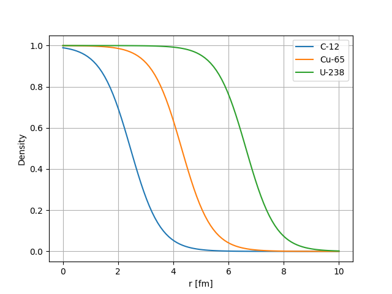
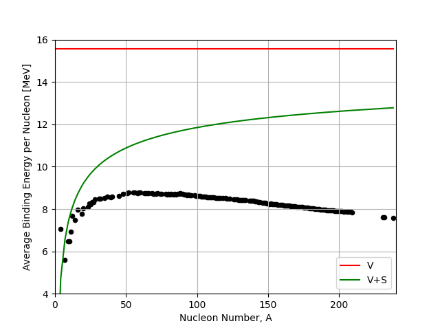
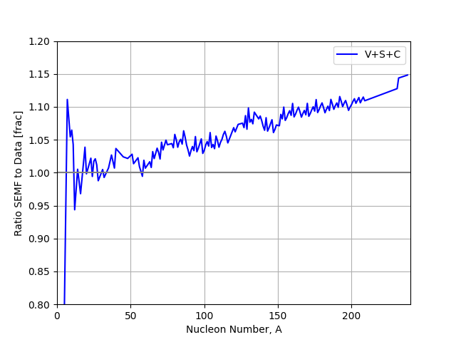

## Liquid Drop Model

So what might the charge and mass distribution be like in Nuclei and how is the Hofstadter experiment interpreted to tell us about it? We know from Rutherford that nucleons in nuclei are likely incompressible. In this unit we'll see how assuming an incompressible fluid model for the nucleus gives us a simple empirical way to describe some of the features we see in nuclear binding energies. You may  already have some exposure to this through studies of the **semi-empirical mass formula** in year two, but in this course we are going to dig deeper into the reasoning for this model and its strengths and weakness, to justify future extensions.

### Form Factors

So based on what we saw in the last unit the models assuming scattering of a point source need to be modified if we want to better fit observed data. 
To factor in the possibility of scattering of a distribution of charges  we need to introduce a so called Form-Factor, $F$, that encompasses information on the structure of the nucleus.

The modified cross-section for a target with a distributed charge distribution can be written as

```{math}
:label: distxsec
\begin{equation}
\left(\frac{d\sigma}{d\Omega}\right)_{\textnormal{distributed}}  = |F({\bf q}^{2})|^{2}\times \left(\frac{d\sigma}{d\Omega}\right)_{\textnormal{point-like}},
\end{equation}
```

where ${\bf q}$ is the four-momentum transfer of the interaction, calculated from the incoming electron momentum, ${\bf p}_{1}$, and outgoing electron momentum, ${\bf p}_{2}$, as ${\bf q} = {\bf p}_{1}-{\bf p}_{2}$, $F$ is our form factor, and the point-like cross-section is our Mott prediction from the previous unit.


To reiterate, a form factor, $F$, provides additional information on how the distributed structure of the nucleus modifies the interaction probability. Form factors are essentially the Fourier Transform of the density distribution.

```{math}
:label: formfactor
\begin{equation}
F(q) = \int_{-\infty}^{\infty} e^{i~{\bf q} \cdot {\bf r} / \hbar} ~\rho({\bf r})~d^{3} {\bf r}
\end{equation}
```

where $\rho({\bf r})$ is the charge distribution, and ${\bf r}$ is the position. With this relation we can plug in different possible charge distributions of the nucleus and see which one best fits the data. This means detailed measurements of the cross-section over different values of $\bf q$ allow us to place strong constraints on the the underlying charge distribution itself.

```{note}
It's worth pointing out here that the Fourier transform of a delta function is just $1$, so if the nucleus was indeed a point charge at the center, we would arrive at the same cross-section for a point-like target as before.
```

Based on our reasoning that the nucleus has some underlying distribution of charge the simplest model we could come up with would be a so called **Top-Hat Distribution**. That is, constant uniform density, falling to zero at the "edge" of the nucleus.  Importantly what was actually found during the early electron scattering experiments was that at higher values of $\bf q$ we start to see bumps or ridges in our measurements of the cross-section as shown in {numref}`e-scattering-charge`. 

:::{figure-md} e-scattering-charge


Measured cross-section from electron scattering of nickel.
:::


The shape of these structures give an indication of something very close to a top-hat distribution in the center of nuclei, but also that a more "fuzzy" form is needed at the edges. A better fit to the data is given by a so called Saxon-Woods form which accounts for this edge. The Saxon-Woods potential modifies the simple top-hat by introducing a smooth edge parameterized in terms of the radius, $r$, as follows:

```{math}
:label: saxonwoods
\begin{equation}
\rho(r) = \frac{\rho_0}{1+{\textnormal{exp}}[\frac{r-a}{d}]}
\end{equation}
```


- $a$ is the "edge" of the nucleus defining the width of the top-hat.
- $d$ is the so-called Skin or Surface Thickness.
- The same form applies for both the charge and density distribution with slightly different 

The plot below shows the charge density versus distance $r$ from the centre of the nucleus for several known nuclei. We see that as the nuclei size increases the "top-hat" part of the distribution just gets slightly wider but the skin thickness that defines the fall of close to the edge of the nucleus remains mostly constant.


:::{figure-md} saxonwods


Saxon Woods charge distribution shape vs Distance from the center of the nucleus for several nuclei.
:::


**Typical Values For the charge density distribution**

```{math}
:label: chargedist
\begin{equation}
\rho_{\textnormal{charge}}^{0} = \frac{\rho^0_{\textnormal{charge}}}{1+\textnormal{exp}[\frac{r-a}{d}]}
\end{equation}
```

- $a = 1.07 A^{1/3} ~\textnormal{fm}~~\textnormal{(radius)}$ 
- $d = 0.54~\textnormal{fm}~\textnormal{ (skin thickness)}$ 
- $\rho^{0} = 0.06-0.08~e~\textnormal{fm}^{-3}~\textnormal{ (average charge density)}$
- Note: We expect $\rho^{0}$ to be lower for heavy nuclei as $Z$ tends away from $N$.


**Typical Values For the mass density distribution**

```{math}
:label: massdist
\begin{equation}
\rho_{\textnormal{mass}}(r) = \frac{\rho^0_{\textnormal{mass}}}{1+\textnormal{exp}[\frac{r-a}{d}]}
\end{equation}
```

- $a = 1.2 A^{1/3} ~\textnormal{fm}~~\textnormal{(radius)}$ 
- $d = 0.75~\textnormal{fm}~\textnormal{ (skin thickness)}$ 
- $\rho^{0} = 0.17~e~\textnormal{fm}^{-3}~\textnormal{ (average charge density)}$

  <p> <br> </p>

Key observations for both models are:
- Modifications are needed between mass distributions and charge distributions due to neutrons having zero-charge.
- The parameter values are quite similar in both cases.
- The charge radius and mass radius both scale as $A^{1/3}$.
- The central densities are constant, independent of how many nucleons there are in the nucleus.


Studies of electron scattering data found this generally gave a good fit across many nuclei. The last point on central densities is important as it points at a fundamental idea in nuclear physics - the **Incompressible Nucleus**.

### The Liquid Drop Model
####  Introduction

All the above early studies and information on the nucleus start to lead us towards some basic models to explain the behavior of nuclei. The most basic is the Liquid Drop Model (LDM), based on a description of the nucleus as a drop of "Nuclear Fluid" analogous to a water droplet.

The LDM arises from the following main observations:
- Nuclei are spherical (in general) with central density having a fixed value independent of radius. i.e. no matter how many nucleons you pile in to make your nucleus bigger, the density remains the same, the nuclear fluid is Incompressible (like a water drop).
- The observation that the radius (size) of the nucleus goes as $R \sim A^{1/3}$.
- The force binding the nucleons together appears to be short range - rather like the intramolecular force in liquids.
- The Binding Energy Curve suggests that whatever size of a nucleus, a nucleon situated inside has roughly the same binding energy as all other nucleons. It takes roughly the same energy to free it no matter how many other nucleons are present (neglecting proton/neutron mass differences as we will see later).
   
These four arguments allow us to build a simple model of the nucleus that satisfies all constraints - The Liquid Drop Model. The assumptions of the model are:

1. The forces between nucleons are; **Repulsive** at very short separations, **Attractive** at separations similar to particle size, and **Negligible** at larger distances. The collective attraction of nuclei is what keeps them bound together contributing a negative **Volume Energy**.
2. The centre of the nucleus is an **Incompressible Nuclear Fluid** with constant density which is independent of radius, and having a positive **Surface Tension Energy**. Assuming the fluid is non-rotating, in absence of other forces, the shape adjusts to minimize the surface tension energy resulting in a spherical shape.
3. If the drop carries Electric Charge then this is uniformly distributed throughout the drop. This combined with the Repulsive Force leads to an additional positive **Coulomb Potential Energy** in the nucleus.

Putting this together mathematically in the Liquid Drop Model (LDM) leads to an equation for the binding energy for the nucleus as 

```{math}
:label: simpledropmodel
\begin{equation}
B(A,Z) = a_{v}A - a_{s}A^{2/3} - a_{c}Z(Z-1)A^{-1/3}
\end{equation}
```

In line with our description we have three terms:

$$
\textnormal{Volume Energy Term :}~~ a_{v}A
$$

$$
\textnormal{Surface Tension Energy Term :}~~ a_{s}A^{2/3}
$$

$$
\textnormal{Coulomb Potential Energy Term :}~~ -a_{c} \frac{Z(Z-1)}{A^{1/3}}
$$

Note dividing B(A,Z) by the total nucleons A, gives us a prediction for the binding energy per nucleon plot we discussed in the last set of lectures. 

By convention we talk about the binding energy as a positive value (e.g. $52~\textnormal{MeV}$ for Carbon-12) when in fact it's a negative value when considering all nucleons in the nucleus - **energy needs to be added** to the system for us to liberate a nucleon. Our **negative** volume potential energy term above therefore corresponds to a positive term in the binding energy estimate in the LDM equation.


To understand in a bit more detail the components of the SEMF lets go through them one by one seeing how they improve our fit to real data. We'll take the data from the IAEA database, and select only the most abundant nuclei with the highest binding energy for each possible value of $A$. This is how the figures you've already seen for binding energy are actually made.

#### Energy Terms
##### The Volume Energy Term

This is the main term, its positive, associated with the short range forces between nucleons pulling them together, its the same for all nucleons (a constant),hence the total for a nucleus is just proportional to the number of nucleons $A$. 

```{math}
:label: simpledropmodel_be
\begin{equation}
B_{E} \propto A = +a_{v}A ~~~~~~~~ 
\end{equation}
```


The $a_{V}$ term sets the scale of the energies we are dealing with in nuclear physics. It is typically given as $a_{V} = 15.56~\textnormal{MeV}$. 

Once the other terms are included (subtracting from this Volume term) we find that a good typical value for the Binding Energy per Nucleon is about $8~\textnormal{MeV/nucleon}$. We therefore expect the other terms to reduce the binding energy by around $7-8~\textnormal{MeV}$.

:::{figure-md} semf1


Volume term (V) in the liquid drop model compared to the IAEA binding energy data.
:::


##### The Surface Tension Energy Term
This is a correction to the Volume Term, subtracting from it, to allow for the assumptions that the outer nucleons near the surface will be less tightly bound. These nucleons make the nucleus weaker, so feel less of the short range attractive forces between nucleons compared to those nucleons well inside the nucleus. It's like a surface tension term. It's no surprise then that it is a proportional to the surface area which is proportional to $A^{2/3}$.

```{math}
:label: simpledropmodel_bs
\begin{equation}
B_{S} = -a_{s} A^{2/3} ~~~~ a_{s} = 17.23 MeV.
\end{equation}
```


See here the effect of the surface term. It has the greatest effect on small nuclei, because they have a greater fraction of their nucleons near the surface compared to inside. 


:::{figure-md} semf1


Volume (V) and Surface (S) term in the liquid drop model compared to the IAEA binding energy data.
:::


##### The Coulomb Potential Energy Term
This second correction to the Volume Term comes because nuclei contain positively charged protons that repel each other. This electrostatic repulsion also weakens the nucleus, hence a negative term, reducing the overall binding strength.

By assuming the protons are distributed evenly in the spherical nucleus we can deduce the equation by considering the repulsion of a shell of protons of thickness $dr$ due to those inside the shell, and integrating over the entire nucleus size.

Recall first that the electric potential energy of a charge $q_{1}$ in the potential of $q_{2}$ distance $r$ away is:

```{math}
:label: simpledropmodel_epotential
\begin{equation}
E(r) = \frac{1}{4\pi\epsilon_{0}} \frac{q_{1}q_{2}}{r}
\end{equation}
```


The Charge Density (it is uniform remember) is given by : 

```{math}
:label: simpledropmodel_density
\begin{equation}
\rho_{c} = \frac{Q}{V} \approx \frac{3Ze}{4\pi r^{3}_{0}A}
\end{equation}
```


Based on this we see that the Electrostatic Energy in the shell $dr$, we call $dE_{e}$, is given by:

```{math}
:label: simpledropmodel_energysphere
\begin{equation}
dE_{e} = \left[{\rho_c \cdot 4\pi r^{2} dr }\right]_{shell} \times \left[ \frac{4\pi r^{3} \rho_{c}}{3} \times \frac{1}{4 \pi \epsilon_{0} r} \right]_{inner}
\end{equation}
```


which reduces to

```{math}
:label: simpledropmodel_energyspherereduction
\begin{equation}
dE_{e} = \frac{4\pi r^{4}\rho_{c}^{2}}{3\epsilon_{0}} dr
\end{equation}
```


Integrating this out to the maximum radius of the nucleus, $r=0\rightarrow R$, gives the total Electrostatic Energy:

```{math}
:label: simpledropmodel_energyintegralbefore
\begin{equation}
E_{e} = \int_{0}^{R} \frac{4}{3} \frac{\pi r^{4}}{\epsilon_0}\rho_{c}^{2}dr = \frac{4}{3} \frac{\pi R^{5}}{5\epsilon_{0}}\rho_{c}^{2}
\end{equation}
```

Finally, if we substitute in the charge density given earlier we get

```{math}
:label: simpledropmodel_energyintegralafter
\begin{equation}
E_{e} = \frac{4}{3} \frac{\pi R^{5}}{5\epsilon_{0}} \frac{Z^{2}e^{2}}{(4/3)^{2} \pi^{2} R^{6}} =
\frac{3}{5} \frac{Z^{2}e^{2}}{4\pi \epsilon_{0}R}
\end{equation}
```

If we remember that the nuclear size is given by $R=r_{0}A^{1/3}$ where $r_{0}$ is the Nucleon Effective Radius and we gather the constants out we get

```{math}
:label: simpledropmodel_coloumbfinalterm
\begin{equation}
a_{c} = \frac{3}{5} \times \frac{e^{2}}{4\pi \epsilon_{0} r_{0}} \approx 0.7~\textnormal{MeV}
\end{equation}
```

and

```{math}
:label: simpledropmodel_coloumbfinaltermreduced
\begin{equation}
B_{C} = -a_{C} \frac{Z^{2}}{A^{1/3}}
\end{equation}
```

This is close to our contribution we showed in the equations above, however the analysis includes a slight approximation. As charge is quantized the integration over $r$ should really only start once a single charge has been enclosed. If this is accounted for the **Total Electrostatic Energy** is actually given by

```{math}
:label: simpledropmodel_coloumbfinaltermquantised
\begin{equation}
B_{C} = -a_{C} \frac{Z(Z-1)}{A^{1/3}}
\end{equation}
```

The effect this has on our distribution is shown below. We can see that the coulomb term adds some noise to our prediction as it now depends on $Z$ and at higher $A$ the most stable value of $Z$ can vary slightly from nuclei to nuclei.


:::{figure-md} semf2


Volume (V), Surface (S), and Coulomb (C) terms in the liquid drop model compared to the IAEA binding energy data.
:::

This change in shape due to the Coulomb Term is of fundamental importance in Nuclear Physics and has profound implications further on in this course. We see that the effect of the Coulomb Term is to bend the B/A curve down at higher A yielding a peak in the B/A curve. One implication concerns the existence of Nuclear Fission in nature. 
- The gradient of the B/A curve tells us whether energy is released as we move along it. For light nuclei below iron, if nucleons are **added** to the system for example through fusion, then energy is released. 
- In contrast however at higher atomic numbers, for example U-235, then energy is only released if nucleons are **removed** from the nucleus, for example if the nucleus is split up through nuclear fission.

:::{figure-md} semf3

Differences between three term liquid drop model and data.
:::


The basic LDM model as stated so far is pretty good but still does not fit the full average binding energy curve very well.

A clue to how to fix this comes from the other important plot shown earlier, the Chart of Known Nuclei. 

On a quick look we find two important features:
- The most stable nuclei lie roughly on a line where N=Z, nuclei that deviate from this tend to be less stable, (ii) nuclei for which the Z and/or N are an even number tend to be more stable.
- Anything that tends to make nuclei less stable, implying the nucleons are less well bound together, is equivalent to lowering the average B/A value - *we need to account for this*

To do this we introduce two further terms which you may have seen before, the **Asymmetry Term** and the **Pairing Term** as follows:

```{math}
:label: simpledropcombined_extraterms
\begin{equation}
B(A,Z) = a_{v}A - a_{s}A^{2/3} - a_{c}Z(Z-1)A^{-1/3} - \left[a_a(A-2Z)^{2}A^{-1}\right]_{\textnormal{assym}}- \delta_{\textnormal{pair}}
\end{equation}
```

At this stage we can regard both these new terms as arising empirically by observation from the data. Though you might guess that the physics origin comes from treating the nucleus using Quantum Mechanics. Note the negative terms - e.g. the more N deviates from the quality with Z, the more negative is the Asymmetry Term and the weaker bound is the nucleus (lower B/A).


##### Nucleon Pairing Term

Although we can regard the Asymmetry and Pairing Terms as empirical, just an observation that fits the data, we can explain their form better by starting to introduce some Quantum Mechanics (QM). This will lead us later to an improved model of the Nucleus, the Shell Model.

Both protons and neutrons are Fermions, i.e. they have Asymmetric Wave Functions and spin =1/2. Thus they obey the Pauli Exclusion Principle. So we would expect that only two protons (or two neutrons) can occupy a given energy state, one with Spin-up the other Spin-down. In fact the coupling of these spins means it is energetically favorable to have pairs of neutrons or pairs of protons, rather than an odd neutron or proton alone in a given level.

In the figure below each line corresponds to a new energy level that the protons or neutrons can occupy when the states below them are filled.

:::{figure-md} nucleon-pairing-digram


Possible pairing states of protons, each possible energy state or 'level' can have two protons or neutrons inside it, provided their spins are opposite.
:::

We might expect that the neutrons and protons in a nucleus might best pile into energy levels in pairs. If each sequential level has a higher energy this would allow most nucleon to be in the lowest energy levels as possible and would be the most stable configuration. Based on this simple pairing idea there are three possible states
- **Even-Even**  Even numbers of protons and even numbers of neutrons would therefore yield the largest positive contribution to the binding energy. This is referred to as an Even-Even configuration.

- **Even-Odd** If we have a single left over proton, or a single left over neutron, we end up with only one partially filled energy level on the neutron or proton side. This is referred to as an Odd-Even state and as a result the nucleus is less bound and it is a state of intermediate stability. This is because the unpaired nucleon is not tightly bound.

- **Odd-Odd**  Finally we can consider states where both an odd proton and an odd neutron is left. These are referred to as Odd-Odd states. Because they are the least stable they are very rare in nature.

So how nucleons pair up is important in the binding energy and this dictates the $\delta_{pair}$ term. 

```{math}
:label: simpledropcombined_terms
\begin{align}
\delta_{\textnormal{pair}} &= +a_{p}A^{-1/2} ~~~~\textnormal{for N odd AND Z odd}\\
\delta_{\textnormal{pair}} &= 0 ~~~~~~~~~~~~~~~~~~~\textnormal{for N even OR Z even} \\
\delta_{\textnormal{pair}} &= -a_{p}A^{-1/2} ~~~~\textnormal{for N even AND Z even}\\
\end{align}
```

Note the negative term in the binding energy equation that cancels out the negative term in the **Even-Even** case to produce an **increase in binding energy** overall (the nucleus is more stable). The $A^{-1/2}$ part is an empirical fit and the $a_p$ factor is a constant. Its important to get the sign of the term correct.


##### Nucleon Assymetry
Finally we also see that nuclei are also more stable, roughly, if there are qual numbers of neutrons and protons (and preferably in pairs, Even-Even).

In the simplest QM Model (an infinite 3d potential well) we can assume that spacing between the energy levels is a constant value and is proportional to the inverse of the volume hence $\Delta E \propto A^{-1}$. A full derivation of this is beyond us at this point but if we were to do so it would yield the form 

```{math}
:label: simpledropcombined_assymn
\begin{align}
B_{A} = -a_{a} (A-2Z)^{2}A^{-1}
\end{align}
```

 where $a_{a}$ is another constant. Importantly this gives zero if $N=Z$ as then $A=2Z$. 

If we look at how both the additional pairing and asymmetry terms in our model behave we see that they are capable of bringing us closer to the data.The asymmetry term makes the biggest difference at high $A$ whilst the pairing term brings us slightly closer at low $A$ and has smoothed out the fluctuations we saw at higher atomic mass.  We can now predict the binding energies for most of the common nuclei to within a few percent which is not bad for still a relatively simple model!


:::{figure-md} nucleon-pairing-digram


Volume (V), Surface (S), Coulomb (C), Asymmetry (A), and Pairing (P) terms in the liquid drop model compared to the IAEA binding energy data.
:::


### Total Liquid Drop Binding Energy Equation
With all our terms added together we finally have a

```{math}
:label: simpledropcombined_totalequation
\begin{align}
B(A,Z) = a_{v} A - a_{s}A^{2/3} - a_{c} Z(Z-1) A^{-1/3} - a_{a}(A-2Z)^{2}A^{-1} + \delta
\end{align}
```

or in terms of B/A for the plots above

```{math}
:label: simpledropcombined_totalequationperA
\begin{align}
B(A,Z)/A = a_{v} - a_{s}A^{-1/3} - a_{c} Z(Z-1) A^{-4/3} - a_{a}(A-2Z)^{2}A^{-2} + \delta A^{-1}
\end{align}
```

where 
- $a_{v} = 15.5 \textnormal{MeV}$, 
- $a_{s} = 16.8 \textnormal{MeV}$, 
- $a_{c} = 0.72 \textnormal{MeV}$, 
- $a_{a} = 23.0 \textnormal{MeV}$, 
- $a_{p} = 12.0 \textnormal{MeV}$.

Whilst emperical in its form this is an amazing useful equation as it allows us to make estimates of the energies of radiative emissions. For example, let's say we consider a nuclear reaction such as alpha decay

$$
^{230}Th \rightarrow ^{226}Ra + \alpha
$$

We can use the SEMF to calculate the total rest energy of each component object in MeV, and what we find is that there is a mass deficit which ends up being distributed between the daughter nuclei and the alpha particle in the form of kinetic energy. Due to conservation of momentum the alpha particle carries away most of this energy so our liquid drop model can be used to estimate the energy of alpha decay emissions for different nuclei.


### Conclusion
The Semi Empirical Mass Formula or Binding Energy Equation gives an excellent fit to the overall shape of the Binding Energy Curve and starts to give us the basis of a model for nuclei and how they behave. However, it has its failings. In Summary:

**SEMF Advantages**
- It makes good predictions of the masses and binding energies of most nuclei and explains the basic shape of the Binding Energy (BE) Curve.
- It allows predictions of the energy release in nuclear decay (or energy input needed to make a reaction occur)
- It suggests, for instance, why fission can occur in nature due to changes in the binding energy for fission parents and daughters.
  
**SEMF Disadvantages**
- It does not explain why there are spikes in the BE curve at certain nuclei.
- It doesn't explain nuclei shape, in particular why some are observed to not be spherical.
- It doesn't explain nuclear properties like **Nuclear Spin**, **Parity**, and **Magnetic Moment**. 


Later on in this course we'll see how the SEMF is suitable for doing a lot of different radioactive decay and fusion/fission calculations, but in the next topic instead we'll try to address some of these underlying weaknesses of the model to better understand the true nature of the nucleus.


```{note}
### Example 2.1 : Form Factor Nuclear Size
**Considering Elastic Scattering data for Nickel shown in the lecture notes, estimate the nuclear size.**
In this example we use Figure 2.4 of the textbook by Martin to estimate the radius of the 58Ni nucleus.

The figure shows the differential cross section for the scattering of electrons of energy Ee = 450 MeV off a Nickel target as a function of the scattering angle. The plot shows a few dips that are not consistent with the scattering off a point-like particle, as the scattering off a point-like particle is described by the Mott formula, which is a monotonic function of the angle. Such behaviour is attributed to the presence of a form factor.

For this estimate we make the following assumptions:
• The scattering is elastic, e.g. the energy of outgoing electron is equal to the energy of the incoming electron. This is justified, as the energy of the electron (450 MeV) is much smaller than the rest mass of the nucleus (around 55 GeV). Because of this the momentum transfer $q$ is written as

$$
|q^{2}| = |\vec{p}_{i} - \vec{p}_{f}|^{2} = 2p^{2} - 2p^{2} (1-\cos\theta) 
$$

where we've assumed that the initial and final momenta magnitude, $p$, is constant due to elastic scattering. This can be rearranged to get

$$
|q^{2}| = 4p^{2} \sin (\theta/2)
$$

We can therefore write that

$$
qc = 2pc \sin(\theta/2)
$$

The shape of the nucleus is approximated as a solid sphere with uniform density. Using thi approximation the form factor $F(q)$ is written as

$$
F(q) = 3(\sin b - b\cos b) b^{-3}
$$

with $b=qR/\hbar$. This standard formula is derived in the Martin textbook. Under this approximation the form factor and the cross-section will be zero for a few values of b. The fact that we do not observe a vanishing cross section means that the uniform density approximation is not exact. We can, however, take the position of the first minimum in the cross section as an indication of where the form factor would go to zero if the distribution was perfectly uniform. The first zero of the form factor correspond to the value $b_{1} = 4.49$.


### Step 1
The momentum transfer in a collision can be related to the scattering angle using the formula above

$$
qc = 2pc \sin(θ/2).
$$

The first minimum can be read off the plot and correspond to $θ ≈ 24^{◦}$. Which means

$$
qc=2×450~\textnormal{MeV}× \sin(12^{◦}) =187~\textnormal{MeV}.
$$


### Step 2
The first zero in the form factor function corresponds to the value of $b = 4.49$, using the definition of b we have

$$
R=b\frac{\hbar c}{qc} = 4.49 \times \frac{197~\textnormal{MeV fm}}{197~\textnormal{MeV}} = 4.8~\textnormal{fm}
$$

Note that if we ue the formula for the nuclear radius we would have

$$
R=1.21 A^{1/3}~\textnormal{fm} = 4.7~\textnormal{fm}
$$

which is remarkably close.
```

```{note}
### Example 2.2 : Nuclear Charge Distributions
**Considering measurements of the charge distrtibution of nucleons for several nuclei shown in the lecture notes, determine an estimate of the mean nucleon denisty in nuclei.**
The graph presented in the lectures shows the Saxton-Woods distribution of
the charge inside the nucleus. In this example we evaluate the density of nucleons inside the nuclear region for two nuclei: 12C and 208Pb.

We assume that the density of nucleons is proportional to the charge density and is given by

$$
\rho_{nucl} = \frac{A}{Ze} \rho_{ch}
$$

where we indicated with $ρ_{nucl}$ the density of nucleons and with $ρ_{ch}$ the charge density. We can read the plateau value of ρch off the graph for the two elements under consideration.

For 12-C we have $ρ_{ch} ≈ 0.08~e$ which gives

$$
\rho_{nucl} = \frac{12}{6e} \times 0.08~e = 0.16~ \textnormal{nucleon/fm}^{3}
$$


For 208-Pb we have $ρ_{ch} ≈ 0.06~e$ which gives

$$
\rho_{nucl} = \frac{208}{82e} \times 0.08~e = 0.15~ \textnormal{nucleon/fm}^{3}
$$


The average value is roughly constant throughtout the $A$ spectrum and is

$$
\rho_{nucl} = 0.17~\textnormal{nucleon/fm}^{3}
$$
```

```{note}
### Example 2.3 : Nuclear Radius
**Based on the idea of a hard nuclear cutoff derive an expression that relates the radius of the nucleus with the total nucle number**

The graph presented in the lecture of the root-mean-square (RMS) of the nuclear matter as a function of the atomic mass number $A^{1/3}$ shows a fit to the data gives a parametrisation

$$
\sqrt{<r>}=0.94 A^{1/3} \textnormal{fm}
$$

Under the assumption that the nucleus is a sphere or radius $R$ and uniform density, the density would be

$$
ρM(r)=M \frac{3}{4\pi R^{3}}~~\textnormal{for}~~r<R \\ 
$$

and

$$
ρM(r)=0~~\textnormal{for}~~r>R
$$

The quantity $< r^{2} >$ is calculated as

$$
<r^{2}> = \frac{1}{M} \int r^{2} \rho_{M}(r) d^{3}r = \frac{1}{M} \int^{R}_{0} r^{2} \rho_{M}(r) 4\pi r^{2} dr
$$

where the integration over the angular coordinate was carried out to give a factor of $4\pi$. Substituting the expression for $ρ_{M}(r)$ we have

$$
<r^{2}> = \frac{3}{R^{3}} \int_{0}^{R} r^{4}dr = \frac{3}{5} R^{2}
$$

Therefore the nuclear radius is

$$
R = \frac{5}{3} \sqrt{ <r^{2}>} = 1.21~A^{1/3} fm
$$

```

```{note}
### Example 2.4 : Mirror Nuclei
**Consider the nuclei 15-O and 15-N. Evaluate the difference in mass energy between the two nuclei using the SEMF and comment on why such a difference is observed.**

We note that for each nuclei we have $A=15$, it is just the number of protons or neutrons that are swapped as Oxygen has 8 protons, and Nitrogen has 7. These are therefore **Mirror Nuclei**.

If we want to evlauate the difference in mass energy between the two nuclei we can simply subtract the mass calculated for each one using the SEMF. Before we do this however it's worth evaluating which termss in the liquid drop model for binding energy actually contribute. The volume term and surface tension term only depend on $A$ so both these terms cancel out if we take the difference as $A$ is constant. Both nuclei are also Even-Odd (as $A$ is odd) so that means the delta term also goes to zero. Therefore only the Assymmetry and Coulomb correction term contribute. 

We can take this one step further because a quick evaluation of the Asymmetry term gives us 
- 15-O : $a_{a} (15 - 2 \times 8)^{2} = a_{a} (-1)^{2} = a_{a}$
- 15-N : $a_{a} (15 - 2 \times 7)^{2} = a_{a} (1)^{2} = a_{a}$

The result is therefore that the asymmetry term will also cancel out, so any differences between the nuclei will mainly be down to the Coulomb term.


If we evaluate the difference in binding energy we get

$$
M(8,15) - M(7,15) = \left[ 8 m_{p} + 7m_{n} - B(8,15) \right] - \left[ 7 m_{p} + 8 m_{n} - B(7,15) \right]
$$

Rearranging this it becomes

$$
\Delta M = \left[ m_{p} - m_{n} \right] + \left[ B(7,15) - B(8,15) \right]
$$

We expect our binding energy terms to just be dominated by the difference in coulomb terms we therefore get

$$
\Delta B = \frac{a_{c}}{15^{1/3}} (8(8-1) - 7(7-1)) = 4.08 \textnormal{MeV}
$$

Substituting this in with the difference in mass between protons and neutrons we get

$$
\Delta M = \left[ -1.29 \textnormal{MeV} \right] + \left[  4.08 \textnormal{MeV} \right] = 2.79 \textnormal{MeV}
$$

So we find that actually there is an increase in overall mass energy (so a lower binding energy) for oxygen compared to nitrogen despite the fact that there are more protons (which are lighter than neutrons). This is because our Coulomb repulsion term contributes much more than the masss difference of a proton and neutron reducing the overall stability of the nucleus as we add protons.

Note that its also possible to do this assuming the $Z^{2}$ instead of $Z(Z-1)$ Coulomb term that is sometimes considered in the literature instead. If you do so you'll end up with a different energy (by around 7%) but the conclusions are still the same.
```

