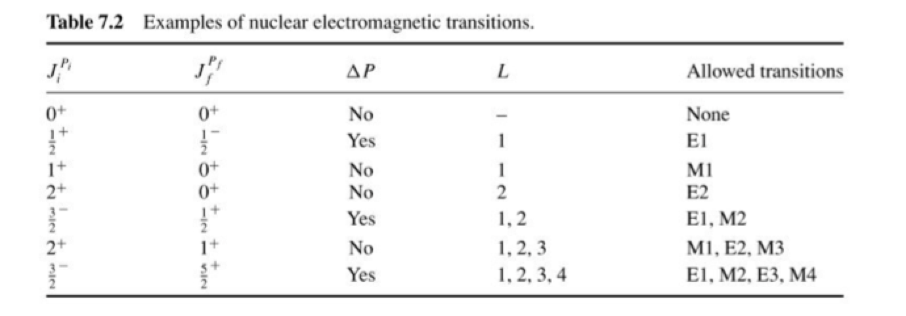
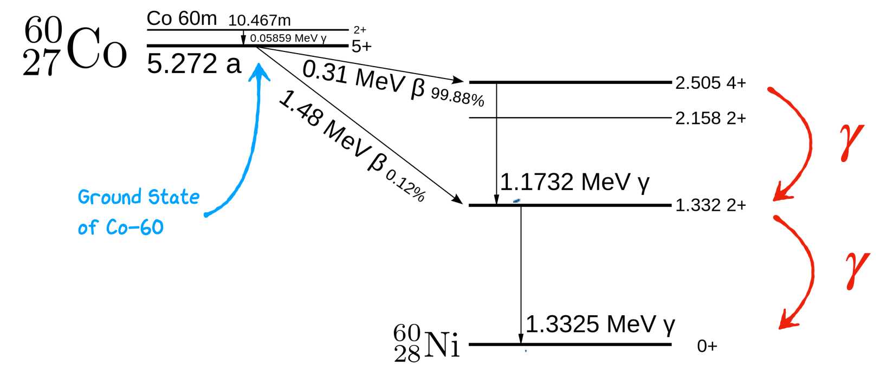

## Collective Models

### Introduction
We saw in the previous unit that while the simple spherical shell model is capable of describing basic properties of nuclei like magic numbers, it fails to capture all features observed in the chart of all nuclei.

The way to deal with this is to use a combination of concepts often referred to as Collective Models. The idea of a collective model is to merge concepts where the behavior of individual nucleons is used, as in the Shell Model, with aspects where the behavior of the nucleus as a coherent single entity is considered.

In a sense, the Semi-Empirical Mass Formula is already a collective type model as it involves combining elements that take account of individual nucleons, such as the Pairing Term, with elements that are about the Bulk Nucleus as a whole, such as the Volume Term. A collective body aspect in which no account is taken of individual nucleonic state or behavior, and an individual particle aspect, where individual nucleons take on discrete energy levels and states. The most interesting area where a collective treatment is needed is with large nuclei, like U-235. Such nuclei show deformities in their shape and exhibit exotic behavior that can be modeled as either vibrations and rotations of the bulk nuclear material acting together.

The motivation of the Collective Model is to assume that an interaction occurs between the outer nucleons and the closed-shell core of these nuclei, leading to deformation of the whole nucleus. The result is that there is still a central nuclear potential due to the filled core shells as before in the basic Shell Model, with nucleons in the outer shells moving under the influence of this core potential. But importantly, the potential is now not necessarily spherically symmetric. It may be deformed, either permanently or actually changing with time. The concept here is to invoke an extension of the Liquid Drop and Shell Models to include the physics associated with deformation of nuclei away from the basic spherical shape to more complex shapes, as illustrated below:


:::{figure-md} collectivediagram


Diagrams of possible nuclear shapes based on different poles. Further visualizations for the spherical, prolate, oblate, and hexadecapole are given in the visualizers section.
:::

The combination of the single-particle and liquid drop models presents very difficult theoretical problems, including the need for the Single Particle State to be calculated for both spherical and non-spherical potentials. That is beyond our scope here, so we concentrate on the qualitative features.

Allowing a nuclear core to be deformed in our model changes the possible Shell Energy Levels, because the Nuclear Potential Well shape is changed for deformed nuclei. This introduces two new types of Collective Modes of Excitation and with them associated energy levels due to (a) Vibration states and (b) rotation (Rotational States). We expect that the allowed energy levels for both of these modes will also be quantized in some way, depending on the shape of the nucleus.

### Rotational States

Let's consider the rotational states first. We can start by describing the shape as a revolution around some central point, with Cylindrical Symmetry, and two extreme cases as shown below, following the prolate and oblate structures we saw previously when considering the electric quadrupole moment of nuclei.

If we modify our model to remove the requirement that nuclei are spherical, what we find in the full derivation of the Schrödinger's Equation is that wave functions based on nuclei occupying physical spaces based on Laplace spherical harmonics are also valid solutions. Since a linear combination of any two equations that satisfy Schrödinger's Equation are also valid solutions, we could consider particle wave functions that are arbitrary combinations of spherical harmonics. However, what we actually find is that when considering the possible discrete energy levels of the nucleus, different harmonics correspond to different states. Laplace Spherical Harmonics are described in general form as $Y_{l,m}$ and are shown in their base form in the image below. You'll see that $Y_{0}^{0}$ corresponds to our simple case of a plain sphere.

:::{figure-md} laplaceshapes


Diagram of possible spherical harmonics that contribute to underlying nuclear structure. Further visualizations are given in the contents panel.
:::


To better understand the relation between spherical harmonics lets consider the simplest possibe case for a deformed nucleus. Imagine we have for the sake of argument a blob of our hypothetical nuclear material, and we deform it (*squash it down*) so that it has an oblate structure like in the previous unit. This change in shape can be represented in our waveform by considering a state which is a combination of our spherical form $Y_{00}$, and the first quadrupole spherical harmonic corresponding to $Y_{20}$ as in the picture below.

:::{figure-md} oblateexample


Example of how variations in $\beta$ change the shape of the nucleus.
:::


We express this algebraically by saying that the surface of our nucleus has a radius at a given angle in spherical co-ordinates as 

$$
R(\theta, \phi) = R_{av} [Y_{00}+\beta Y_{20} (\theta, \phi)]
$$

where $Y_{20}$ is a Laplace spherical harmonic representing the distance from origin to the surface of the shape, $R_{av}$ is the average nuclear radius, and $\beta$ is a deformation parameter. As shown in the picture below we expect that as we increase $\beta$ the shape of our nucleus slowly transitions between $Y_{00}$ and $Y_{20}$ states. In reality our deformed nuclei may be somewhere in between.


Note also that $Y_{00}$ is just our spherical shape and has a constant value of $Y_{00}=1$ so we've dropped the angular dependence there in the equation.  The important thing to notice is that if $\beta$ is equal to zero, then we have only the $Y_{00}$, and we arrive at a spherical nuclear shape as in the figure. Exactly what we want in the no deformation case!

If $\beta$ is non-zero however we get slight modifications of our nuclear shape as a result. The deformation parameter $\beta$ can be expressed in terms of the actual nuclear radius as

$$
\beta = \frac{4}{3} \sqrt{\frac{\pi}{5}} \frac{\Delta R}{R_{av}}
$$

where $R_{av} = r_{0}A^{1/3}$. In our simple case $\beta>0$ corresponds to a prolate nucleus as we've stretched out the top, and $\beta< 0$ corresponds to oblate as we've expanded the sides. $\Delta R$ here represents the difference between the semi-major and semi-minor axes (long and short sides) of the nucleus itself when it is deformed. A typical value for $\Delta R$ is around 0.3 fm.

Note here we are talking of a permanent deformation in shape. Thanks to the charge distribution we thus expert to get a finite Electric Quadrupole Moment. In addition now however we also see possible rotation states as along certain axes (perpendicular to the axis we squashed our nucleus) the shape is not rotationally symmetric. Based on the nuclear shapes shown above you can imagine being able to rotate the nucleus rotating along two axes, either around the page, or out of the page.

It turns out the **intrinsic** Electric Quadrupole Moment of a deformed nucleus is directly related to the deformation of the nucleus itself. It  is given by:

$$
Q_{0} = \frac{3}{\sqrt{5\pi}} R_{av}^{2} Z \beta (1+0.16\beta)
$$

This is the intrinsic electric quadrupole moment for a deformed nucleus at rest. Note how it depends on a surface area $R_{av}^{2}$, the number of protons $Z$ and the deformation parameter. You can see how $Q_{0}$ becomes zero for the spherical case, i.e. when $\beta$ = 0. 


So, what about the Rotational Energy Levels? In classical mechanics, this comes from considering the kinetic energy of a rigid rotating body with angular momentum $\hat{L}$.

In the classical case, we get the equation for the kinetic energy of a Rigid Rotation $L_{c}$ given its rotational kinetic energy and effective moment of inertia $I_{c}$ as.

$$
E_{R} = \frac{L_{c}^{2}}{2I_{c}}
$$

Now, switching to the quantum mechanical case, the energies are given by solving the relevant Schrödinger Equation. We replace the angular momentum $L$ with an operator acting on the wave function. Then the Eigenvalues and Eigenfunctions are given as follows:

$$
\frac{\hat{L}^{2}}{2I} \psi = E_{J} \psi
$$
$$
\hat{L}^{2} Y_{JM}(\theta,\phi) = J(J+1) \hbar^{2} Y_{JM} (\theta, \phi)
$$
$$
E_{J} = \frac{\hbar^{2}}{2I}J(J+1)~~~~~J=0,2,4,\ldots
$$

Note that there is some Reflection Symmetry in this solution, so it turns out that there are no odd $J$ values and the only allowed $J$ values are 0, 2, 4, etc.

Now substituting the quantized allowed $J$ values, we can write out the sequence of energy levels as follows:

$$
E(0^+) = 0
$$
$$
E(2^+) = \frac{\hbar^{2}}{2I} 2(2+1)
$$
$$
E(4^{+}) = 20\frac{\hbar^{2}}{2I}
$$
$$
E(6^{+}) = 42\frac{\hbar^{2}}{2I}
$$

See how we get a neat sequence where the energy levels go as 0, 6, 20, 42, etc., times a constant value based on the nuclear spin. The states are labeled by the $J$ value as shown, and the Parity, which is always positive here.

A useful trick with this sequence is that if we happened to have measured one of the values, then we can predict the rest, using the sequence. For instance, if we consider the $E(2^{+})$ level or $E_{2}$, the first excited state above the ground level, then we can write:

$$
E_{J} = \frac{1}{6} J(J+1)E_{2}~~~~~~~~~J=0,2,4,\ldots
$$

As an example, say we know the first excited state of Erbium-164, i.e., $^{164}Er, E(2^{+}) = 91.4 keV$, then using the equation above, we can predict the Rotational Energy States of Erbium for the higher levels $E(4^+), E(6^+), E(8^+)$, etc.

### Vibrational States
We've discussed rotation states as mentioned above, where the deformation is permanent, and we get energy levels associated with quantized allowed rotations. But in large nuclei, we can also get vibration states in which the nuclear fluid undergoes continuous shape changing or shape oscillations while maintaining constant density. These are the vibration energy states.

```{note}
The Incompressible Nucleus: A vital point, as throughout when we consider the nucleus, is to remember we are dealing with an incompressible object. It may change shape as we have seen, but the density *must* remain constant.
```
The Vibration states we introduce are time-variable changes in surface shape that yield quantized standing waves. That is, what we need to envisage here is standing wave patterns. In the quantum world, only certain such standing waves are allowed, as determined by the relevant quantum numbers. The details are beyond our scope here, but we can gain a general picture.

Note that the average shape might be spherical, or it could be a deformed shape, depending on the nucleus. Either way, the instantaneous shape will be non-spherical.

Firstly, we need to describe the surface. This is done again using Spherical Harmonics and Legendre Polynomials but instead now we consider time-varying  standing wave patterns based on the harmonics. In spherical coordinates, we can consider the instantaneous coordinate of a point on the surface at θ, φ as a linear combination of many possible harmonics as before

$$
R(t, \theta,\phi) = R_{av} + \sum_{\lambda>1}^{\lambda=\infty} \sum_{\mu=-\lambda}^{\mu=+\lambda}  \alpha_{\lambda \mu}(t) Y_{\lambda \mu} (\theta, \phi)
$$

Note how this time we include all possible spherical harmonics $Y_{\lambda\mu}$ that may contribute, and each possible shape has its own amplitude $\alpha_{\lambda \mu}$ and is time varying.

The basic modes of vibration are determined by the $\lambda$ factor here as:
- $\lambda=0$ Monopole - forbidden
- $\lambda=1$ Dipole - Not considered
- $\lambda=2$ Quadrupole
- $\lambda=3$ Octupole

The first state is forbidden because the oscillations over time only modify the radial component ($Y_{00} = 1$). If $\alpha_{00}$ had any time variability, this would result in fluctuations in the density of the nucleus, which is forbidden in our incompressible model.

The second state is not considered because the dipole form produces net shifts in the center of mass (all neutrons and protons moving up and down together). This cannot result from internal forces, only external ones, so it is not worth considering in our nucleus-centric model.

The first important vibrational model is therefore the Quadrupole.
The various allowed vibrational states in nuclei are very complicated, but we can get a feel for their behavior. For the simplest even-even nuclei, the Ground Vibration State is designated $0^{+}$. If we add a unit of Quantized Vibration (a phonon) $1\hbar \omega$, we get to the first quadrupole state designated $2^{+}$.

The quantized unit of vibration is called a Phonon. The first level can be thought of as the First Harmonic of vibration. We can think of $\lambda$ as a unit of angular momentum, $l$, so the parity of this state $(-1)^{2}$, i.e., positive. If we add another phonon, we start to see higher harmonics. These are labeled by the $\mu$ in the equation, ranging from $\mu=-\lambda$ to $\mu=+\lambda$, i.e., a total of $2\lambda +1$, that is $5$ for $\lambda=2$. As we have two phonons, there is a lot of symmetry, so we end up with $3$ possible substates, labeled $0^{+}$, $2^+$, and $4^+$. This is summarized below in the example of $^{114}Cd$.

Notice that for higher states, since only even values of $J$ are allowed, we end up with all the higher states of our even-even nuclei also having positive parity.

An important point to note here is that the basic energy levels at each phonon level are equally spaced, in units of $1\hbar \omega$. So, unlike the rotation energy levels, where the spacing increases in a sequence $0, 6, 20, 42, ...$, the basic vibration energy levels are evenly spaced, with each level having finely split sub-levels at each basic level due to the phonon couplings.

The basic vibrational energy levels can be written as follows

$$
E_{N} = \hbar \omega_{l} \left(\frac{2l+1}{2} +N \right)
$$

Here $N$ is the number of oscillator quanta, and $l$ is the quantized oscillator state (0-monopole, 1-dipole, etc). So here we see that the Quadrupole ($l=2$) Ground State (no phonons) has an energy level at

$$
E_{N} = \left(\frac{5}{2}\right) \hbar \omega
$$

Of course, a nucleus can show both Rotational and Vibrational energy levels, and these levels can overlap. Note that in general, rotational levels can go up to higher energies than vibration, the latter reaching typically 1-2 MeV.

Note that as nuclei move away from having a closed shell, it gets easier to excite rotation and vibration states; they are more distorted as we expect. So these nuclei tend to have lower collective mode excitation states like this.

At half-filled shells, we get the extreme, with more likely permanently deformed states, strong rotation states, and large electric quadrupole moments. In extreme cases, like U-236, we get lots of levels indicating a very deformed nucleus. It is not surprising we end up seeing spontaneous fission as that below.

So we have seen in this unit again that the nucleus is a complex object. To understand all the energy levels and behaviors, we need a Collective Model that combines the Shell Model with the bulk behavior of nuclear fluid. 

### Gamma Decay

Up until now in our examples we've considered the case where protons and neutrons fill up our shells sequentially. The shell model however also predicts excitations when protons or neutrons are pushed up to a higher energy levels. Remember the nucleus wants to naturally go to the state of lowest energy, so these higher energy states will eventually decay down to the lower state again and emit gamma radiation.

The energy of the emitted gamma radiation is dependent on the energy splittings between the levels that the nucleon has moved between, in exactly the same way as electron orbital transitions. The difference in our case is the more complex spacing of the shells, and the fact that we have two seperate shell structures, one for neutrons and one for protons.

 Let's explore how the shell model helps explain gamma radiation and the conditions for gamma-ray decay:

1. **Excitations in the Shell Model:**
   Up until now, we have considered scenarios where protons and neutrons fill up nuclear energy shells sequentially. However, the shell model predicts that excitation can occur when a nucleon is pushed to a higher energy level. These higher energy states are not stable, as the nucleus naturally tends to reach its lowest energy state.

2. **Gamma Radiation Emission:**
   When a nucleon in a higher energy state decays to a lower energy state, it emits gamma radiation. Gamma radiation consists of high-energy photons. The energy of the emitted gamma radiation depends on the energy difference between the levels that the nucleon has moved between, much like electron orbital transitions in atomic physics.

3. **Complex Shell Spacing:**
   Unlike electrons in atoms, nucleons in nuclei experience a more complex spacing of energy shells. Additionally, there are two separate shell structures, one for neutrons and one for protons, due to their different properties. This complexity leads to a variety of possible energy transitions in nuclear systems.


There are some considerations we need to make when trying to assess whether a gamma ray decay actually takes place.

**Angular Momentum and Radiation Types:**
When the nucleon undergoes an energy transition, it emits a photon (gamma ray) to return to the ground state. The photon carries a total angular momentum, including its own spin. The minimum value of angular momentum ($\vec{L}$) for gamma radiation is 1 therefore the transition also needs to induce a change in angular momentum of the nucleus of at least 1.

- If $\vec{J_i}$ (initial spin vector) is equal to $\vec{J_f}$ (final spin vector), the transition is forbidden. This means that gamma-ray transitions typically involve changes in angular momentum. Lower values of $L$ make the transition more probable, with $L=1$ transitions being the most common.

- Depending on the value of L, different types of radiation are possible:
  - L=1 corresponds to dipole radiation.
  - L=2 corresponds to quadrupole radiation.
  - L=3 corresponds to octupole radiation, and so on.

**Parity Conservation:**
 In gamma-ray transitions, parity is conserved. Electric multipole radiation has parity $(-1)^l$, while magnetic multipole radiation has parity $(-1)^{(L+1)}$. Any transition has to make sure that parity is also conserved between the states, this means we if we know the parity of the starting and final nucleon state we can estimate the form of the radiation.


 


 Above are some possible transitions based on values of $J_{f}$ and $J_{i}$ and whether these are likely to be due to electromagnetic or magnetic multipole radiations. The most likely transitions are described below.
 - **Electric Dipole (E1) Transitions:** These transitions involve $ΔL = 1$ and result in a parity change of π = $(-1)^1$ = -1 (parity-changing). Electric dipole transitions are more common than other multipole transitions and have relatively higher probabilities. 

 - **Magnetic Dipole (M1) Transitions:** These transitions involve $ΔL = 1$ and result in a parity change of π = $(-1)^{1+1}$ = 1 (parity-preserving). Magnetic dipole transitions are less common than E1 transitions but still occur in certain nuclear decays.

 - **Quadrupole (E2) Transitions:** Quadrupole transitions involve $ΔL = 2$ and result in a parity change of π = $(-1)^2$ = 1 (parity-preserving). Quadrupole transitions are less probable than E1 and M1 transitions and are associated with higher-order nuclear excitations.


```{note}
Here the $J$ terms correspond to the vector components of the nuclear spin. When we say that the an equal $\vec{J}_{i}$ and $\vec{J}_{f}$ state mean that the transition can not take place we mean it in terms of the vector components since $\vec{J}_{i} = \vec{J}_{f} + \vec{L}$. 

We can however have cases where the overall nuclear spin $I$ is identical before and afterwards, in this case we expect the allow magnitude of $\vec{L}$ to be

$$
| I_{f} - I_{i} | \leq L \leq|I_{f} + I_{i}|
$$

Note that this is now the projected magnitude of $L$, and follows similar vector rules to those we have seen before. 
```


### Example: Cobalt-60 Decay
As an example for gamma ray decay lets consider Co-60. This is a very common radio-isotope used in nuclear labs to calibrate detector response as placing it in a gamma spectrometer results in two two very clear gamma ray peaks at 1.1732 MeV and 1.3325 MeV next to one another that can be used to assess detector resolution. Co-60 itself however is primarily a $\beta$ emitter as we see in the figure below. What happens during a radioactive decay of Co-60 is that 99\% of the time it converts into an excited state of Nickel which subsequently emits gamma radiation.



Cobalt-60 (Co-60) undergoes beta decay, resulting in the formation of Nickel-60 (Ni-60). During this decay, several electromagnetic transitions can occur, and we will focus on the relevant details:

1. **Beta Decay of Co-60 to Ni-60:**
   Co-60 decays primarily through beta-minus (β-) decay. In this process, a neutron in the Co-60 nucleus is transformed into a proton, emitting an electron (beta-minus particle) and an antineutrino. This transformation leads to the formation of Ni-60:

   Co-60 (Z=27, N=33) → Ni-60 (Z=28, N=32) + β- + ν̅ᵢ

   The decay process itself does not directly involve electromagnetic transitions. However, the resulting Ni-60 nucleus may exist in an excited state, and subsequent gamma-ray transitions can occur as Ni-60 de-excites to its ground state.

2. **Gamma-Ray Transitions in Ni-60:**
   When Ni-60 is formed it is in an excited state, it undergoes de-excitation to reach its ground state. These gamma-ray transitions involve changes in angular momentum (L) and parity (π) of the nucleus as we see it jump betwen the $4^+$, $2^+$, and $0^{+}$ states. Because $L=4$ transitions have a lower probability, the nucleus also tends to avoid jumping straight from the $4+$ state to $0+$, and instead emits to gamma rays as it moves down the energy levels. The short decay times of these two states results in two gamma rays being emitted in a very short time period corresponding to the two energy differences between these levels and showing up as two co-incident peaks in gamma ray detectors.
   <br>

   Note that because of the larger energy jump the $4+$ state is far more likely to decay into the lower $2+$ state than the higher one resulting in 1.1732 MeV being one of the dominant gamma rays emitted. Both of these emissions are E2 transitions. 


In the next few lectures, we'll probe further into the behavior of excited states of the nucleus and how this can lead to different forms of spontaneous radioactive decay. Before we do that however lets understand what else our simple shell model can say about one form of radiation, 


