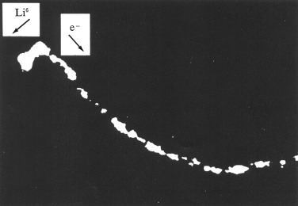
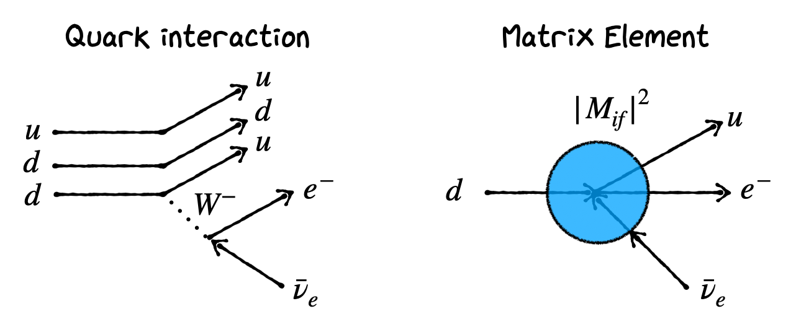
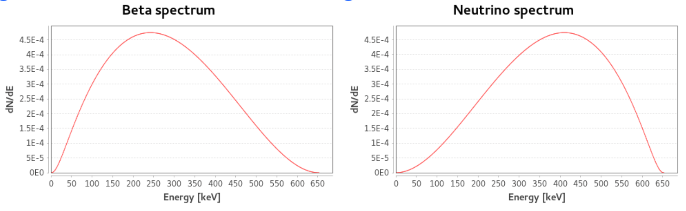
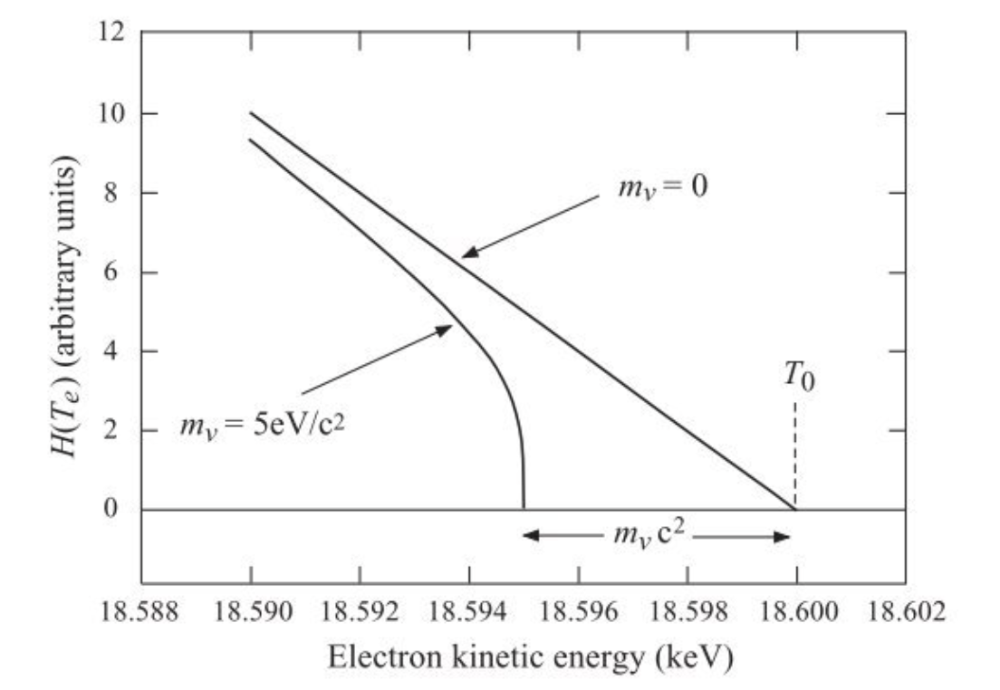
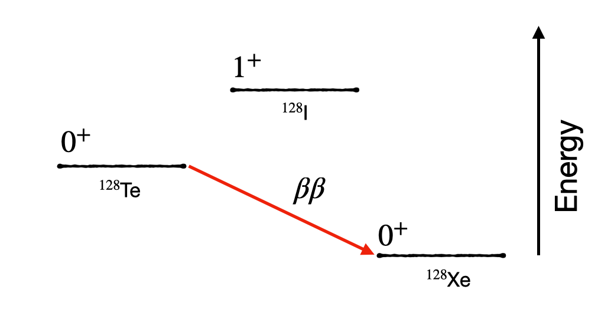
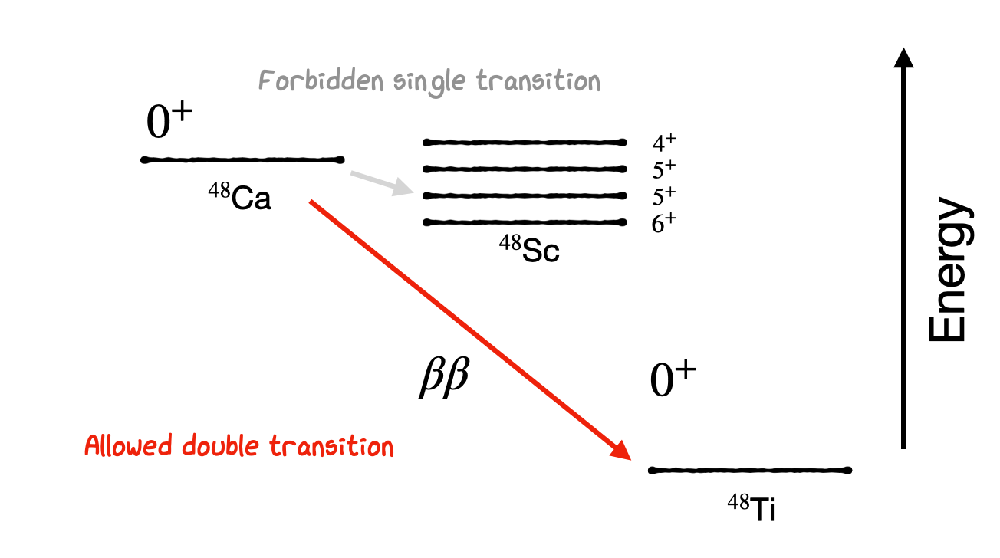
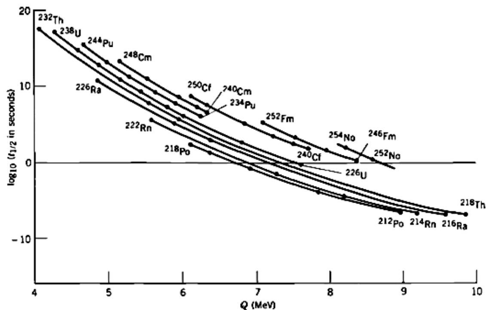
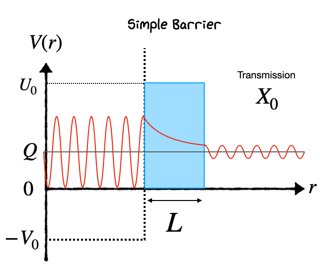
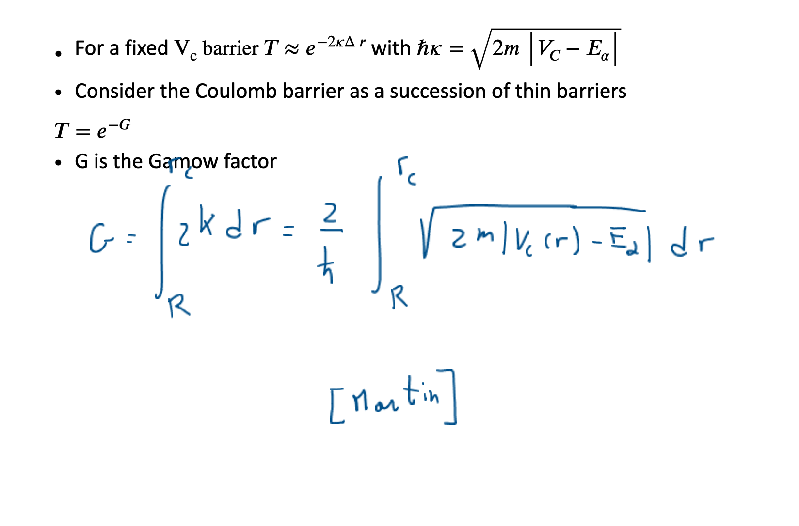
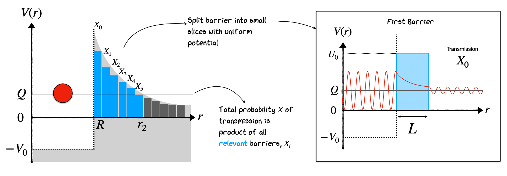

## Radioactive Decays

### Introduction 
As we saw in the previous unit, nuclei in excited states can emit radiation in the form of gamma rays when nucleons move between different shell levels. This explains one of our three dominant sources of radiation. What about the others, $\beta$ and $\alpha$ decay?

These become a bit trickier to solve, as both decays lead to a fundamental change in the nucleon content inside the nucleus itself. As a reminder, in all cases of radioactive decay, we characterize the process in terms of three important numbers:

- The probability of decay per unit time $\rightarrow \lambda$
- The average time a nucleus lasts before decay $\rightarrow \tau = 1/\lambda$
- The time for half the sample to decay (half-life) 

$$T_{1/2} = \tau \textnormal{ln}(2) = 0.693\tau$$

Radioactive decay itself is a stochastic process. That is why we define it in terms of the average times it takes bulk samples of material to decay. The main thing that governs the rate of this decay in a nucleus is actually whether the process is energetically favorable or not. In gamma radiation we saw it was almost always energetically favorable for an excited nuclear state to drop down some energy levels by emitting radiation.

What about other forms of radiation? In alpha and beta radiation the nucleus physically changes from one type to another. It turns out that a nucleus is likely to be unstable and decay through these channels if the net energy of the final products $E_{f}$ is less than that of the starting nucleus $E_{i}$. This energy deficit is defined as: 

```{math}
:label: massdeficit
\begin{equation}
Q = M(A,Z)^{2}c^{2} - [M(A-X,Z-Y)c^{2} + M(X,Y)c^{2}] > 0 
\end{equation}
```

Decay is possible only if the $Q$ value is positive, and the decay is not disallowed by any other selection rule or conservation law. The energy released in the decay will come out in the kinetic energy of the release fragments in the decay. Let's consider both beta decay and alpha decay in turn to see how theoretical concepts of the nucleus help us understand their behavior.


### Beta Decay

In beta decay we typically see experimentally an emission of an Electron from the nucleus combined with a transmutation of a nucleus from one type into another with a lower neutron number. This is referred to as beta-minus decay and typically occurs in neutron rich nuclei which are trying to lower their energy by rebalancing their proton/neutron ratios. 

In the early years of Beta Decay studies the process observed was highly mysterious and showed very different a behavior to Alpha Decay which was being studied at a similar time. This is illustrated by the Cloud Chamber image shown below. 

:::{figure-md} neutrino-emission


Bubble chamber photo of He-6 decay into Li-6, showing what appears to be non-conservation of momentum.
:::


We see the decay of $^6$He into $^6$Li and a charged electron. We see two tracks, curving because there is a magnetic field applied. But from analysis of the plot it looks like energy, momentum and even Total Angular Momentum $I$ are not conserved if we assume the interaction:

$$
 ^6\textnormal{He}~\rightarrow~^{6}\textnormal{Li} + e^- 
$$

Of course the reason is that there is a Neutrino emitted as well, but this escapes the detector and we don’t see it. There are actually four things we need to consider in beta-minus(-plus) decay not just the neutrino.

1. Beta Decay is a Three-body Process, unlike alpha decay (two body). We have to account for the energies and behavior of 3 objects - the nucleus, the beta and neutrino.
2.  The electron (positron) and neutrino produced do not exist before the decay, we need to account for their formation.
3. The electron and neutrino are relativistic, unlike the alpha in alpha decay. This makes calculations of the energies and kinematics of the decay more complicated.
4. The energy of the beta emitted by the nucleus in question is not the same in every decay. We get a continuum of energies put to a maximum. In contrast to alpha decay and gamma decays where we get one “Mono energetic” particle depending on the energy levels or $Q$ value considered. The quark level interaction is given in the figure below. Typically the 'Matrix Element' is calculated based on the interacting particles considering the d quark in the initial state and u quark and electron and anti-neutrino in the final state.



An example to illustrate this behavior is:

$$
\bf
 _{83}^{210}Bi \rightarrow _{84}^{210}Po + e^- + \bar{\nu}_e 
$$

Note how with an electron emitted in beta decay we get an Anti-neutrino (this is Lepton Number conservation in particle physics)

Beta decay is a common type of radioactive decay that involves the transformation of nucleons within the nucleus, resulting in the emission of beta particles and a change in the nuclear charge. There are three main types of beta decay: electron emission ($\beta^-$ decay), positron emission ($\beta^+$ decay), and electron capture (EC). Each of these processes alters the nucleus in distinct ways, driven by the weak nuclear force. Here's a breakdown of their differences:

#### Electron Emission ($\beta^-$ Decay)

- **Process:** In $\beta^-$ decay, a neutron inside the nucleus is transformed into a proton, an electron ($e^-$), and an electron antineutrino ($\bar{\nu}_e$).
  
- **Equation:** $n \rightarrow p + e^- + \bar{\nu}_e$

- **Result:** The atomic number ($Z$) of the nucleus increases by one, while the mass number ($A$) remains unchanged. This process leads to the element changing to its next higher neighbor in the periodic table.

- **Driving Force:** $\beta^-$ decay occurs in neutron-rich nuclei, where the neutron-to-proton ratio is higher than that for a stable isotope of the element.

#### Positron Emission ($\beta^+$ Decay)

- **Process:** In $\beta^+$ decay, a proton is converted into a neutron, a positron ($e^+$), and an electron neutrino ($\nu_e$).
  
- **Equation:** $p \rightarrow n + e^+ + \nu_e$

- **Result:** The atomic number ($Z$) decreases by one, but the mass number ($A$) remains the same. The element changes to its previous neighbor in the periodic table.

- **Driving Force:** $\beta^+$ decay is favored in proton-rich nuclei, where the proton-to-neutron ratio is higher than the stable ratio for that element. It requires more energy than $\beta^-$ decay, as the mass of the nucleus must compensate for the mass of the positron and the difference in mass between protons and neutrons.

#### Electron Capture (EC)

- **Process:** In electron capture, an inner orbital electron is captured by a proton in the nucleus, resulting in the formation of a neutron and the emission of an electron neutrino.
  
- **Equation:** $p + e^- \rightarrow n + \nu_e$

- **Result:** Similar to $\beta^+$ decay, electron capture decreases the atomic number by one without changing the mass number, shifting the element to its previous neighbor in the periodic table.

- **Driving Force:** EC also occurs in proton-rich nuclei and can be thought of as an alternative to $\beta^+$ decay, especially in cases where the energy difference between the initial and final states does not favor positron emission. It strongly competes with $e^+$ decay and is the only decay available to nuclei with a Proton Excess if the mass difference between the atoms is less than $1~\textnormal{MeV}/\textnormal{c}^2$.

### Energy Considerations and Occurrence

Note we have to be careful in Beta Decay to consider the mass of everything including the Atomic Electrons, not just the nucleons. Hence the mass used are atomic masses, not the nuclear masses. We were less careful earlier when dealing with Binding Energy calculations and the SEMF.

- **$\beta^-$ Decay:** This process is energetically favored in neutron-rich nuclei and does not require additional energy to occur since the mass of the neutron is greater than that of the proton. The $Q$ value for this interaction is calculated based on the atomic masses as

```{math}
:label: betamqvalue
\begin{equation}
Q_{\beta^{-}} = [ M(A,Z) - M(A,Z-1) ]c^{2}
\end{equation}
```


- **$\beta^+$ Decay and EC:** Both require the nucleus to have excess energy because the mass of a neutron is less than that of a proton (when considering the mass of the positron for $\beta^+$ decay or the binding energy of the captured electron for EC). These processes are less common than $\beta^-$ decay due to the energy requirements and occur in proton-rich nuclei.

The Q value for $\beta^+$ decay based on atomic masses is calculated as

```{math}
:label: betapqvalue
\begin{equation}
Q_{\beta^{+}} = [ M(A,Z) - M(A,Z-1) - 2m_{e}]c^{2}
\end{equation}
```

In the case for electron capture, the $Q$ value needs to be calculated based on the energy of the electron that is captured based on which atomic orbital shell it is in (typically an inner shell).


### Beta Decay Matrix Element

Typically we find that the average Beta decay rate is proportional to $1/Q^{5}$ of the interaction itself. This is the Sergeant rule that derives from the theory of weak interactions. Note that this $Q$ value is the total energy available for the decay based on the mass differences, but we expect a continuous spectrum when looking at just the electron energy for example.

As discussed in Krane, the probability of a beta decay occurring is proportional to the square of the matrix element, $M$, which depends on the overlap of the initial and final nuclear wave functions and the operators involved in the transition. 


```{math}
:label: lambdacalc
\begin{equation}
\lambda = \frac{2\pi}{\hbar} ~| M_{if} |^{2} ~\frac{dn_{f}}{dE_{f}}
\end{equation}
```

where $\lambda$ is the rate $M_{if}$ is the nuclear matrix element, and $\frac{dn_{f}}{dE_{f}}$ is the 'density of states'. We expect that as the density of possible states increases so to does the rate of interaction.

The nuclear matrix element is commonly written based on some interaction Hamiltonian, $\hat{H}$ that describes the transition,

```{math}
:label: matrixelement
\begin{equation}
|M_{fi}| = \int \psi^{*} \hat{H} \psi dV.
\end{equation}
```


Weak interactions typically follow a $V-A$ form for the Hamiltonian, where $V$ corresponds to vector couplings (typically the electromagnetic part in electroweak interactions), and the $A$ corresponds to axial couplings (which carry the weak force).

If we consider that the neutrino and electron in $\beta^{-}$ decay are being produced  some distance $\vec{r}$ from the centre of the nucleus with momenta $\vec{p}$ (electron) and $\vec{q}$ (neutrino), then we can estimate the density of states at that momentum based on the volume of a spherical shell of thickness $dp$ or $dq$ as

```{math}
:label: densitystateselectron
\begin{equation}
dn_{e} = \frac{4 \pi p^{2} dp V}{h^{3}}  
\end{equation}
```

```{math}
:label: densitystatesneutrino
\begin{equation}
dn_{v} = \frac{4 \pi q^{2} dq V}{h^{3}}  
\end{equation}
```

The combined density of states can then be estimated from

```{math}
:label: densitystatescombined
\begin{equation}
dn_{e}dn_{v} = \frac{ (4 \pi)^{2} ~ V^{2} ~ q^{2} dq ~p^{2} dp}{h^{6}}  
\end{equation}
```

If we consider the possible wave functions for our electron and neutrino we can consider free particle solutions in the first case

$$
\psi_{e}(r) \propto e^{i \frac{\vec{p}\cdot\vec{r}}{\hbar}} ~~~~~~~ \psi_{\nu}(r) \propto e^{i \frac{\vec{q}\cdot\vec{r}}{\hbar}} 
$$

If we consider the energy scales of beta decay, the electron is expected to have an energy in the range of around 1 MeV. This corresponds to around $p/\hbar \sim 0.007~\textnormal{fm}^{-1}$ much smaller than the nucleus itself. As a result we can approximate the wavefunction as

```{math}
:label: allowedapprox
\begin{equation}
e^{i \frac{\vec{p}\cdot\vec{r}}{\hbar}}  \approx 1 + i\frac{\vec{p}\cdot\vec{r}}{\hbar} + .... \approx 1
\end{equation}
```


This last approximation where we assume the wavefunction is constant means the terms are constant in the matrix element calculations and only way that the rate depends on the momentum is in the density of states.

When we account for this our density of states can be used to arrive at a form given in Krane for the number of beta particles at a given momentum of

```{math}
:label: densityfinal
\begin{equation}
N(p) = \frac{C}{c^{2}} p^{2} (Q-T_{e})^{2}
\end{equation}
```

where $C$ is a constant, $c$ is the speed of light, $p$ is the momentum of the emitted beta particle, $Q$ is the mass deficit for the decay, and $T_{e}$ is the kinetic energy of the beta particle. You can see how this has a zero point both at $p=0$ and $Q=T_{e}$ corresponding to our end points of beta decay.

As shown in the figures below for Cu-64 we expect a continuous distribution as a result. In fact what we find is that additional corrections are needed for $\beta^{-}$ vs $\beta^{+}$ decay since positrons typically observe additional coulomb repulsion inside the nucleus.



One way to understand allowed vs forbidden transitions is by producing what are called "Fermi-Kurie" plots. Based on the form shown above, if we plot the observed number of particles at a fixed momentum divided by $p^{2}$ and an additional correction due to coulomb repulsion, what we find is a roughly linear fit to the data for many transitions. The point where this line crosses the x-axis determines the end point energy (maximum $T_{e}$ of the transition). Linearity in this fit ends up only being true when our "allowed transition" assumption are valid. Any deviation from a straight line suggest a degree of "forbidden-ness" in the interaction. Importantly a Fermi-Kurie plot can be used to estimate the neutrino mass as the end point is expected to deviate from a straight line if the neutrino mass is non-zero as shown in the Figure below.

:::{figure-md} fermi-kurie


End point of the Fermi-Kurie plot which plots beta particle kinetic energy vs a scaled estimate of the number of particles observed at that energy. Deviations away from a straight line suggest forbidden transitions. The end point $T_{0}$ here corresponds to the maximum $Q$ value for the decay.
:::

For allowed transitions, the matrix element involves simpler operators (e.g., Fermi and Gamow-Teller operators), while for forbidden transitions, more complex operators that include higher angular momentum components are required in the calculation. These higher order corrections that include the second term in the exponential expansion above are referred to as 'forbidden transitions'.


### Transitions

In beta decay, transitions between nuclear states are classified as "allowed" or "forbidden" based on certain selection rules derived from conservation laws and quantum mechanics. These rules are related to the spin ($I$) and parity ($P$) of the initial and final nuclear states, as well as the angular momentum and parity of the emitted beta particle and neutrino system. 

Allowed transitions are those that require the least change in angular momentum and have no change in parity between the initial and final states. The simplest case is the "superallowed" transition, which involves no change in nuclear spin and parity ($\Delta I^\pi = 0^+$) and is the most favorable in terms of transition probability.

We expect that the spin of the electron and anti-neutrino (both spin half particles) can come out either parrallel or anti-parallel with one another, carrying either $S=0$ or $S=1$ respectively. The transitions where they are parallel are referred to as **Gamow-Teller** transitions, whilst those where they are anti-parallel are referred to as **Fermi** transitions.

**Superallowed Transition:**

$$
 \Delta I = 0, \quad \Delta \pi = \textnormal{none}
 $$
 

Here, $\Delta I$ represents the change in total angular momentum quantum number, and $\Delta \pi$ represents the change in parity; $0^+$ indicates no change in either. We typically find that transitions with the shortest corrected half-life (corrections account for differences in the energy distribution and density of states) all correspond to this class of allowed transitions. This is why they are called "super-allowed".

**Allowed Transition:**
For "allowed" transitions (not superallowed), the changes are still minimal:

$$
 \Delta I = 0 \text{ or } \pm 1, \quad \Delta \pi = \textnormal{none}
 $$
 
except for $0 \rightarrow 0$ transitions, which are forbidden.

Superallowed and allowed transitions are characterized by a high transition probability because they involve minimal changes in the nuclear state, making them the most common type of beta decay. They correspond to the case where we produced the particle in our density of states at $\vec{r}=0$ such that the wavefunction does not depend in any way on the momentum for the transition.

**Forbidden Transitions**

Forbidden transitions occur when the change in angular momentum and/or parity does not meet the criteria for allowed transitions. They are less likely to occur due to the need for higher changes in angular momentum between the initial and final states. Forbidden transitions are categorized by the degree of "forbiddenness," which corresponds to the change in angular momentum of the emitted particles.

$$
 \Delta I = 0, \pm 1, \pm 2, \quad \Delta \pi = 1 
 $$
 
except for $0 \rightarrow 0$ transitions, which are still completely forbidden.

In general, the "n-th forbidden" transition is characterized by:

$$
 \Delta I = n, n \pm 1, n \pm 2, ..., \quad \Delta \pi = (-1)^{n}
 $$
 

The transition probability decreases significantly with increasing order of forbidden-ness, making higher-order forbidden transitions increasingly rare.


### Selection Rules Summary
This results in the following complete set of selection rules

- **Allowed** $\Delta I=0,1$ and $\Delta \pi = \textnormal{no}$
- **1st Forbidden** $\Delta I=0,1,2$ and $\Delta \pi = \textnormal{yes}$
- **2st Forbidden** $\Delta I=2,3$ and $\Delta \pi = \textnormal{no}$
- **3rd Forbidden** $\Delta I=3,4$ and $\Delta \pi = \textnormal{yes}$

Here the 2nd forbidden transitions do actually allow for $\Delta I=0, 1$ but since these are already covered by the allowed transitions these changes in the nuclear spin are far less likely.


### Example: Beta Decay of Nucleus X to Y

Suppose we have a beta decay process where nucleus X decays to nucleus Y. Let's say:

- The initial state of nucleus X has a total angular momentum quantum number $I_i = 2$ and positive parity ($\pi_i = +1$).
- The final state of nucleus Y has a total angular momentum quantum number $I_f = 1$ and negative parity ($\pi_f = -1$).

**Step 1: Calculate the Change in Angular Momentum ($\Delta I$)**


$$
 \Delta I = |I_f - I_i| = |1 - 2| = 1 
 $$
 

**Step 2: Determine the Change in Parity ($\Delta \pi$)**

Since the parity changes from positive to negative, there is a change in parity ($\Delta \pi = +1~\textnormal{or}~-1$).

**Step 3: Classify the Transition**

Using the calculated $\Delta I$ and $\Delta \pi$, we can classify the transition. For allowed transitions, we expect $\Delta I = 0$ or $\pm 1$ (excluding $0 \rightarrow 0$ without a change in parity), and $\Delta \pi = 0$.

- In our example, $\Delta I = 1$ fits the criterion for $\Delta I$ in allowed transitions, but the change in parity ($\Delta \pi = \textnormal{yes}$) indicates this is a **forbidden transition**.
- Specifically, since there's a change in parity and the $\Delta I$ value fits within the first forbidden category (considering $\Delta I = 0, \pm 1, \pm 2$ with a parity change), this would be a **first forbidden transition**.


**Example 1**
For another example of an allowed transition in beta decay, let's consider the beta-minus decay of tritium ($^3H$) to helium-3 ($^3He$):

- **Tritium ($^3H$)** has one proton and two neutrons. Its nuclear spin and parity ($I^P$) are $1/2^+$ in its ground state.
- **Helium-3 ($^3He$)** has two protons and one neutron. Its ground state also has a nuclear spin and parity of $1/2^+$.

In this decay, one of the neutrons in tritium is converted into a proton, emitting an electron ($e^-$) and an electron antineutrino ($\bar{\nu}_e$):


$$
 ^3H \rightarrow~ ^3He + e^- + \bar{\nu}_e 
$$

Given that both the initial and final states have spins of $1/2$, the change in angular momentum is:

$$
 \Delta I = |I_f - I_i| = |1/2 - 1/2| = 0 
 $$
 
In this case we know that the electron and anti-neutrino needed to have taken away either $S=0$ or $S=1$, so we expect this to be Fermi decay. 
Both the initial and final states have positive parity ($+$), so there is no change in parity:

$$
 \Delta \pi = \textnormal{no} 
 $$
 

This means for the transition to be allowed we expect the orbital AM $l$ to be even. Our transition meets these criteria ($\Delta I = 0$ and $\Delta \pi = \textnormal{no}$), indicating it is an **allowed transition**.


**Example 2**
Now consider the example of beta decay in $^{6}\textnormal{He} \rightarrow~^{6}Li$. In this case we expect a transition from $0^{+}$ to $1^{+}$ so we expect a change in one for the nuclear spin, but no change in parity.

We therefore know that that orbital angular momentum has to be even, requiring that the combined spin is $S=1$, so that we get an odd number in $L+S$.

This is therefore a Gamow Teller Transition, which is classified as allowed.

**Example 3**
Finally let's consider the beta decay from $^{17}\textnormal{N} \rightarrow~^{17}O$ where we expect a transition between nuclear spin states $\frac{1}{2}^{+} \rightarrow \frac{5}{2}^{+}$. Here we are expecting $\Delta I=2$ and $\Delta \pi=\textnormal{yes}$.

We know that the orbital angular momentum has to be odd, and therefore we expect again that the spin state must be $S=1$ to give an even total change in spin.

This is therefore a 1st forbidden Gamow Teller decay and is significantly less likely than the decays in the previous examples.


### Double Beta Decay

In rare cases we find that the $Q$ value of a decay or the selection rules limit our typical $\beta$ decay processes. For example in the case of 128-Te, we find that the next nuclei on the beta decay chain would be 128-I, which would give a negative $Q$ value. However a direct transition to 128-Xe would give a positive $Q$ value, and is enough to allow the production of two $\beta$ particles at once. This process whilst extremely rare (order of $10^{24}$ years) can occur naturally.




A similar case also happens for the decay of 48-Ca, which we would expect to decay into 48-Sc. Whilst the $Q$ can be positive in some cases, we find that all the possible transitions are high-order forbidden transitions and are extremely unlikely to occur. Instead it is far more likely that a double beta decay transition will occur (albeit with a very long half-life).



Double beta decay is of particular importance in some high energy particle physics experiments as there is a long standing debate on whether neutrinos may in fact be their own anti-particles (Majorana neutrinos). Since they have no charge this is allowed in some models, and if so would allow a possible neutrino-less double beta decay transition to also take place in which the two neutrino's emitted in double-beta decay annihilate with one another, resulting in both beta particles carrying the entire $Q$ energy for the interaction. Observation of a clear excess in number of particles right at the end of the beta decay spectrum for such nuclei therefore would confirm the true nature of the neutrino.


### Alpha Decay

Finally let's turn our attention to alpha decay. In the context of the nuclear shell model, alpha decay can be understood in terms of the rearrangement of the nucleons in the daughter nucleus and how this rearrangement affects the nuclear stability. The shell model predicts that nuclei near magic numbers (where shells are either fully filled or empty) are more stable. Thus, alpha decay often moves a nucleus closer to these magic numbers, thereby increasing its stability.

While the selection rules for alpha decay are not as strictly defined as for beta decay in terms of angular momentum and parity changes, the energy and stability considerations play a crucial role. The key factors influencing alpha decay include:

1. **Q-Value:** The energy release ($Q$-value) in alpha decay is a critical factor. The decay can only occur if the $Q$-value is positive, meaning the mass of the parent nucleus is greater than the combined mass of the daughter nucleus and the alpha particle. 

2. **Nuclear Shell Effects:** The shell model predicts that nuclei with a full shell of protons or neutrons (magic numbers) are particularly stable. Alpha decay is found for mostly higher $A$ neutron rich nuclei and results in a daughter nucleus that is closer to these magic numbers.

3. **Overlap and Tunneling:** The probability of alpha decay is also determined by the quantum mechanical tunneling effect. As we will see alpha particles need to tunnel out of a potential barrier if they are to escape the nucleus.


Based on our understanding of the nucleus there are some important questions we need to ask for the alpha decay process:
- Why are the $\alpha$ particles emitted and not some other combination of nucleons?
- Why is there such a range of lifetimes and energies? What is the relationship between the two? 
- What determines the frequency of $\alpha$ decay?
- How are the $\alpha$ particles formed in the nucleus and emitted?
- Do alphas carry information on nuclear structure?

One plot that begins to answer some of these questions is a comparison of the $Q$ energy for different alpha-emitting particles separated by different radioactive decay series. This is called the Geiger-Nuttall relation, and it demonstrates that actually for many different series, there is a strong correlation between the radioactive half-life and the energy of the emitted alpha.



Notice also how steep the relation is in the Geiger-Nuttall plot (it's a log scale). An alpha emitter that produces 8 MeV alpha particles is likely to have a half-life over 22 orders of magnitude shorter than one which produces alphas of 4 MeV kinetic energy. The Geiger-Nuttall relation is a fit to the observed data of the form:

$$
\log_{10} t_{1/2} = b_{1} \frac{Z}{Q^{1/2}} + b_{2}
$$

where Z is the number of protons, Q is the energy released, $b_{1}$ and $b_{2}$ are constants. An equivalent form is:

$$
\ln\lambda = -a_{1} \frac{Z}{Q^{1/2}} + a_2
$$

It turns out that trying to understand why the data follows this shape leads us once again to the need for a quantum mechanical treatment of Alpha Decay. To explain the relation, it turns out we need to consider that the alpha forms inside the nucleus and then escapes by Quantum Mechanical Barrier Penetration. 

The alpha is envisioned as a free-particle wavefunction subject to a combination of the Nuclear Potential binding it to the nucleus, and a coulomb potential that repels it from the other charged particles in the nucleus. Typically we expect a coulomb repulsion to push the charged alpha away from the rest of the nucleus, but in this case we are imagining that the alpha is **inside** the rest of the nucleus, therefore the remaining protons form a charged barrier that the alpha needs to tunnel through to escape. The Coulomb barrier arises because the electrostatic force is repulsive between two positively charged entities—the alpha particle and the rest of the nucleus. 

- As the alpha particle gets closer to the nuclear surface (from within), the electrostatic potential energy increases because the repulsive force increases. At the surface of the nucleus, this potential energy reaches a maximum, forming the Coulomb barrier.

- Inside the Nucleus: While inside the nucleus, the alpha particle is bound by the strong nuclear force, which is attractive and much stronger than the Coulomb force at short distances. This force keeps the nucleons (including those in the alpha particle) together.

- Escape Requirement: For the alpha particle to escape, it must have enough energy to overcome the maximum potential energy at the surface created by the Coulomb repulsion. Typically, the alpha particle's kinetic energy (within the nucleus) is insufficient to overcome this barrier due to the energy binding it inside the nucleus.


Of course, in a classical model, if the **Potential Barrier** is too high, the alpha never escapes. In Quantum Mechanics, we allow **Tunneling** with a small probability that the alpha can penetrate the barrier. Calculating the ratio of the wavefunctions inside and outside and squaring gives the probability. We can do a simple calculation of this by considering the diagram of the potential below. We assume the alpha is pre-formed in the nucleus, oscillates around, repeatedly hitting the edge inside the nucleus until at some point it escapes by **Barrier Penetration**. Once formed, the alpha particle finds itself in a potential well created by the nuclear forces. Outside this well, there's a potential energy barrier formed by the Coulomb repulsion between the positively charged alpha particle and the rest of the nucleus. Classically, the alpha particle would need to have kinetic energy greater than this barrier to escape the nucleus. However, typically, the alpha particle's kinetic energy is less than the height of this Coulomb barrier


Notice how the Potential Barrier drops as $1/r$. Rather than try to solve this, we can make a simple approximation that the barrier has a fixed height $U_0$ and fixed length $L$, and that the alpha has energy $E$, as illustrated below. Also, the potential seen by the alpha particle is spherically symmetric, and so the quantum mechanical problem can be approached by first separating the variables into just a radial component.



As a particle approaches the barrier, it is described by a Free Particle Wavefunction. When it reaches the barrier, it must satisfy the simplified Schrödinger Equation in the form:

```{math}
:label: seequation
\begin{equation}
-\frac{\hbar^2}{2m} \frac{d^{2}}{dr^{2}} \psi(r) = [E - U_0]\psi(r) \\
\end{equation}
```

Solving this QM equation of simple Barrier Penetration is beyond our scope here. What is important is the result. It gives us a value for $X$, the probability of barrier penetration as:

```{math}
:label: transmissionprob
\begin{equation}
X = Ae^{-αL}
\end{equation}
```

where $α = \sqrt{(2m(U_0 - E))/\hbar^2}$ is called the Gamow Factor, and $A$ is a normalization constant we will call 1 for now to make the derivation simpler. Now, if we assume the alpha makes contact with the barrier once every second, then the average probability that the alpha leaves (a decay takes place) and the half-life is just related to the tunneling probability by:

```{math}
:label: lambdavsX
\begin{equation}
\lambda = \sqrt{X} 
\end{equation}
```

```{math}
:label: T12calcdecay
\begin{equation}
T_{1/2} = \ln(2)/\lambda = \ln(2)/\sqrt{X}
\end{equation}
```

If the alpha hits the barrier faster than 1 Hz, then we expect the probability that it leaves the nucleus to scale upwards as well. If we can work out the frequency that the alpha hits the barrier, which will be determined by its velocity and the size of the nucleus, and we know the height of the barrier $U_0$ and the width $L$ and the energy of the alpha $E$, then we can find the half-life $T_{1/2}$. We can then see if this agrees with the Geiger-Nuttall observation from data.

### Alpha 212-Po Example

The way to proceed is illustrated below, where we attempt to find the half-life of 212-Po, which emits an 8.78 MeV alpha.  First, we need to find the width of the barrier. For this, we need to know the Nuclear Separation $R$, i.e., the distance between the center of the nucleus and the center of the alpha. Be careful that at this point the nucleus we are talking about is not A=212, but A=208, because we have removed the alpha.


This results in an estimate of the nuclear seperation as

```{math}
:label: Radiuscomp
\begin{equation}
R= 1.2(A)^{1/3} + 1.2(208)^{1/3} = 9.01~\textnormal{fm}
\end{equation}
```

We now find the height of the barrier by applying Coulomb’s Law at the nuclear separation as illustrated here

```{math}
:label: barrierheight
\begin{equation}
\frac{(k\cdot 2e \cdot (Z - 2)e)}{r} = \frac{(2\cdot (84-2) \cdot 1.44~\textnormal{MeV fm})}{9.01~\textnormal{fm}} = 26.21~\textnormal{MeV}
\end{equation}
```

where $k$ is equal to coulombs constant $k = 1/(4πε_0) = 8.987552 \times 10^9 N m^2/C^2$. Now the distance at which the Coulomb Potential drops to the level of energy of the observed alpha is:

```{math}
:label: rcalculation
\begin{equation}
8.78 MeV = \frac{2(82)1.44~\textnormal{MeV~fm}}{r} \rightarrow r = 26.9 \textnormal{fm}
\end{equation}
```

So the barrier width L and Gammow factor is:

```{math}
:label: barrierwidth_ex1
\begin{equation}
L = 26.90 \textnormal{fm} - 9.01~\textnormal{fm} = 17.9~\textnormal{fm}
\end{equation}
```

```{math}
:label: alphaestimate
\begin{equation}
\alpha = \sqrt{\frac{2m(26.2-8.78)}{\hbar^{2}}} = 1.879~\textnormal{fm}^{-1}
\end{equation}
```


When assuming a 'top-hat' potential barrier this results in a transmission probability of 

```{math}
:label: tophatprobresult
\begin{equation}
X = e^{-\alpha L} = e^{- (1.879) \cdot (17.9) } = 2.47 \times 10^{-15}
\end{equation}
```

The real frequency of the alpha hitting the barrier can also be estimated by determining how many times an alpha of energy $8.78~\textnormal{MeV}$ makes contact with the walls.

```{math}
:label: alphavelocity
\begin{equation}
8.78MeV = \frac{mv^{2}}{2} \rightarrow v=2.06 \times 10^{7} ~\textnormal{ms}^{-1} 
\end{equation}
```

```{math}
:label: alphafrequency
\begin{equation}
f=\frac{v}{2R}  \rightarrow 1.14 \times 10^{21} s^{-1}
\end{equation}
```


For a given alpha, the combined Tunnelling Probability per second for emission is therefore the product of the barrier frequency and the transmission

```{math}
:label: tunnellingprobfinal_tophat
\begin{equation}
\lambda = f X = (2.47 \times 10^{-15})(1.14 \times 10^{21}~\textnormal{s}^{-1}) = 2.82 \times 10^6~\textnormal{s}^{-1} 
\end{equation}
```


```{math}
:label: halflifefinal_tophat
\begin{equation}
 T_{1/2} = \frac{\ln 2}{\lambda} = \frac{0.693}{2.82 \times 10^6 s^{-1}} = 2.5 \times 10^{-7}~\textnormal{s} = 0.25~\mu\textnormal{s} 
\end{equation}
```


<!--  -->
The result is quite good. But note we could do better by modelling the potential as a series of decreasing barriers. As shown in the figure below we consider the decaying barrier as a combination of many fixed height barriers. The transmission probability through the entire set of barriers is simply obtained by multiplying all their individual transmission probabilities together.



This can be written as:

```{math}
:label: combinedprob
\begin{equation}
X = X_1 \times X_2 \times X_3 \times ... \times X_n
\end{equation}
```
 
```{math}
:label: combinedprob2
\begin{equation}
X = A \exp \left( -\frac{1}{\hbar} \sum \left(\sqrt{ 2m(U_{i}-Q) }\right) \cdot \Delta r \right)
\end{equation}
```

In the limit as $\Delta r \rightarrow 0$, this analysis turns into an integral from R up to $r_{2}$ based on the known form of $V(r) \propto r^{-1}$

```{math}
:label: combinedint
\begin{equation}
X = \exp \left( -\frac{1}{\hbar} \int_{R}^{r_{2}} \sqrt{2m(V(r) - Q)} \cdot dr \right)
\end{equation}
```

No we can calculate the potential difference in the Gamow factor as based on the potential

```{math}
:label: newpotential
\begin{equation}
V(r) = \frac{2Ze^{2}}{4\pi \epsilon_{0}} \frac{1}{r}
\end{equation}
```

We have defined $r_{c}$ as the point where 

```{math}
:label: newQrelation
\begin{equation}
Q = V(r_{c}) \rightarrow r_{c} = \frac{2Ze^{2}}{4\pi \epsilon_{0}} \frac{1}{Q}
\end{equation}
```

Now subbing this back into our potential tells us $V(r_{c})$ based only on $Q$, $r$, and $r_{c}$ results in a potential dependent on $Q$

```{math}
:label: potentialvsQ
\begin{equation}
V_{c}(r) = \frac{Q r_{c}}{r}
\end{equation}
```

Subbing this into our integral gives us a transmission of the form

```{math}
:label: newXrelation
\begin{equation}
X = \exp \left( -\frac{1}{\hbar} \int_{R}^{r_{2}} \sqrt{2m\left(\frac{Q r_{c}}{r} - Q\right)} \cdot dr \right) \\
\end{equation}
```

where we can pull the $Q$ value out of the integral

```{math}
:label: Xcombinationvsgamow
\begin{equation}
X = \exp \left( -\frac{Q^{1/2}}{\hbar} \int_{R}^{r_{2}} \sqrt{2m\left(\frac{ r_{c}}{r} - 1\right)} \cdot dr \right) = \exp(G)
\end{equation}
```


Rearranging this ends up in a final form where the Gamow factor in our transmission factor is given by

```{math}
:label: GamowFactorCombined
\begin{equation}
G=4 Z \alpha \left( \frac{2m c^{2}}{Q}\right)^{1/2} \left( \cos^{-1}\left( \sqrt{\frac{R}{r_c}} \right) - \sqrt{\frac{R}{r_{c}}\left( 1-\frac{R}{r_{c}}\right)} \right)
\end{equation}
```

In this solution

$$
\textnormal{Last term goes to}~\frac{\pi}{2}~\textnormal{if}~R << r_{c}
$$

and we arrive at a relation for the Gamow factor's correlation with $Z$ and $Q$,

```{math}
:label: GamowFactorRelation
\begin{equation}
G \propto \frac{Z}{\sqrt{Q}}.
\end{equation}
```

Based on our calculations before the half-life is still proportional to the frequency that the alpha contacts the barrier and our new more realistic integrated transmission

```{math}
:label: HalfLifeForm
\begin{equation}
t_{1/2} \propto \lambda = f e^{-G} = f e^{- \frac{D \cdot Z}{\sqrt{Q}}}
\end{equation}
```

where $D$ is a new constant we have introduced based on the full form of Gamow values above. Taking the log of the equation gives us that below which ultimately ends up matching our Geiger Nutall form,

```{math}
:label: GNFormProof
\begin{equation}
\log_{10} t_{1/2} = a + b Q_{\alpha}^{-1/2},
\end{equation}
```

where $a=\ln(f)$ and $b=D \cdot Z$. This confirms why we see this behavior in the first place. The exponential drop in half life for alpha emitters is due to every alpha undergoing tunneling through a falling potential barrier at the edge of the nucleus. 

The procedures shown here can be applied to many nuclei to gain an estimate on the half-life and potential barrier properties if a decay process' $Q$ value is known. Importantly the free parameters in the Geiger Nutall form are dependent on the specific starting isotope (indicated by the lines in the GN plot), therefore measurements of the half life and $Q$ value of one specific isotope can be used to estimate the half-life of any other nuclei in the chain provided the $Q$ value can be calculated to a reasonable estimate (which it can with the SEMF!).

### Summary
In this unit we've discussed the final dominant radioactive decay channels and the effect these can have on the nucleon content of a nucleus, and the various factors that need to be considered when trying to calculate their probability and daughter product kinetic energies.

In the next half of this course we'll start to look at different possible reactions with nuclei in more detail before looking at how knowledge of nuclear structure and decays can be used in applied physics.


