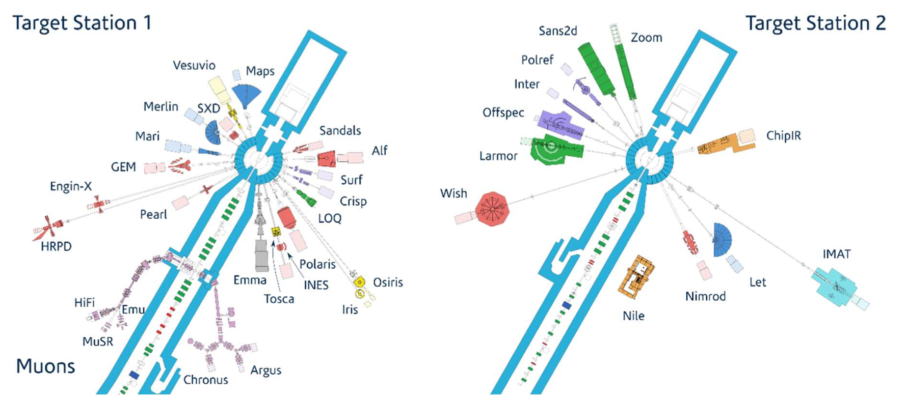
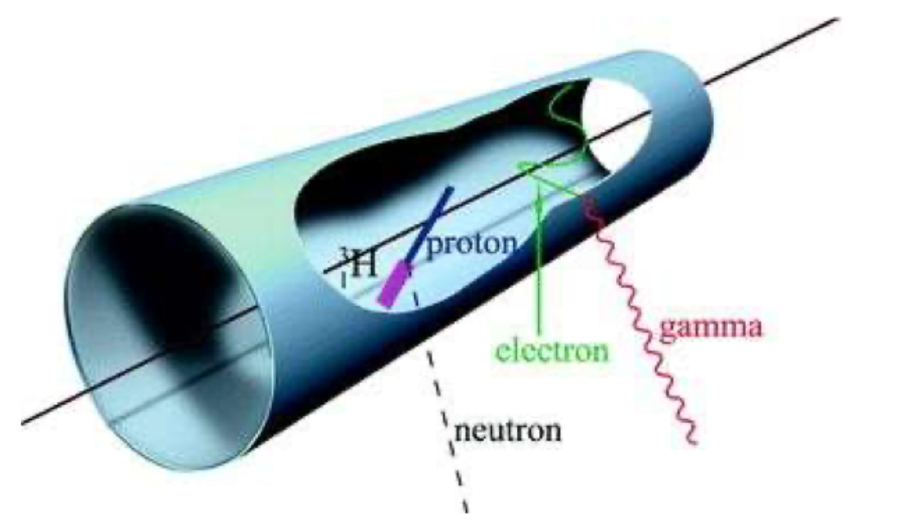
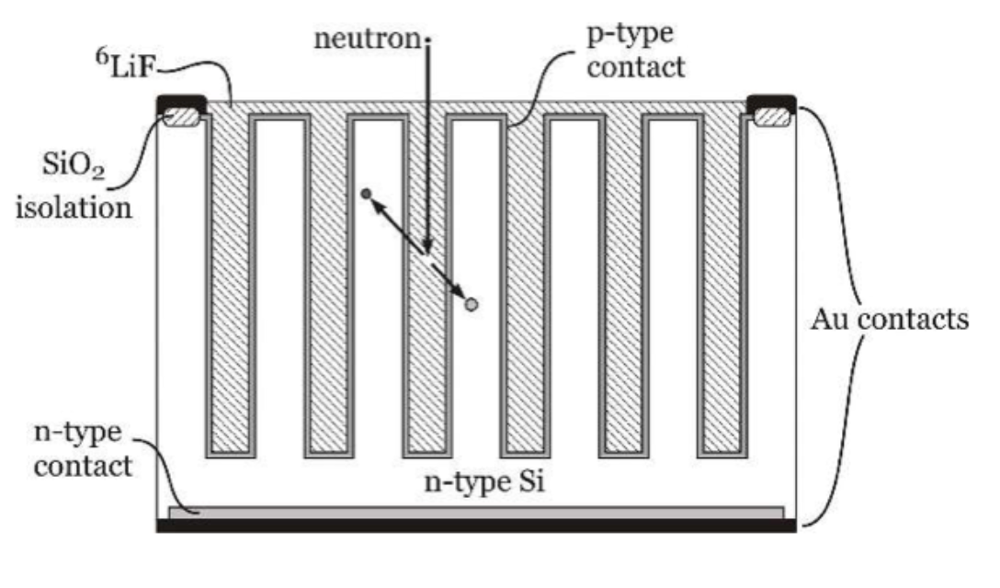
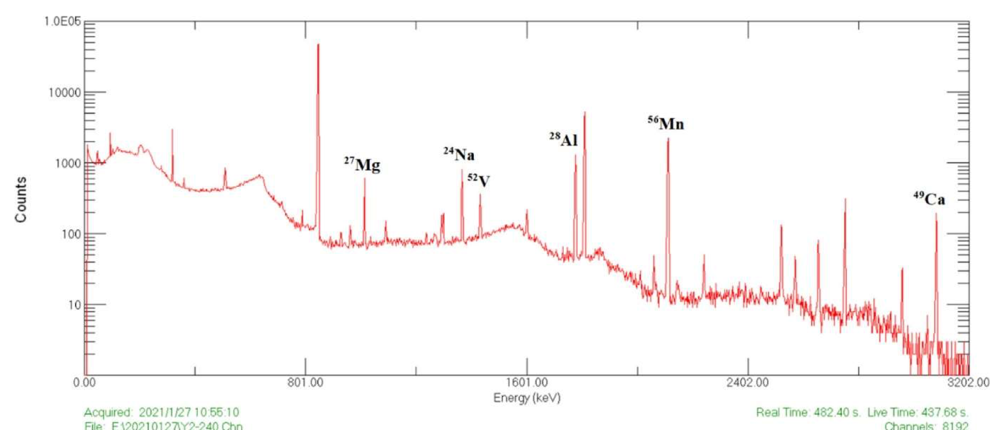

## Neutron Physics
Neutrons are particularly important in nuclear physics because, being uncharged, they see no Coulomb barrier and can be captured by nuclei even at very low energies.  Reactions involving neutrons have many practical applications, most obviously in inducing fission of uranium and plutonium but also in mapping excited states of nuclei, non-destructive assay of materials and production of radionuclides for medical physics and industry.  (These applications are why this section is in Applications of Nuclear Physics, rather than Nuclear Reactions.)

### Neutron Properties
#### Discovery 
It was clear from the initial discovery of the atomic nucleus that the mass of most nuclei was approximately double that of $Z$ protons.  The initial model for this was that the nucleus contained $A$ protons and $A – Z$ “nuclear electrons”, but this model has a number of problems:
- The Heisenberg uncertainty principle, $\Delta x \Delta p \geq \hbar/2, $ predicts that an electron confined within a nucleus of diameter $\sim 10~\textnormal{fm}$ should have a momentum of order $5\times 10^{−21}$ kg m s−1, which implies an energy of about $40~\textnormal{MeV}$.  This is much higher than the observed energies of electrons emitted in $β$ decay.

- The spin of the nucleus did not appear to be consistent with the presence of $A – Z$ spin-½ electrons in addition to A spin-½ protons: for example, 14N, which according to this prescription should contain 21 spin-½ particles and thus have half-integer spin, was actually found to have spin 1.

- Detailed studies of hyperfine structure in atomic spectra failed to display the effects that should have been caused by the magnetic moment of the nuclear electrons.

However, with only the proton and electron known to exist at the time, there was no clear alternative model available, so the options for improving the situation were very limited.

With hindsight, the first observation of the neutron was by Bothe and Becker in 1930.  They irradiated light elements with energetic α particles from polonium decay, and observed the emission of penetrating but non-ionising (thus neutral) radiation, but interpreted this (understandably) as γ radiation.  However, Irène Curie (daughter of Marie) and her husband Frédéric Joliot then observed that this radiation, when impinging on paraffin wax, caused the emission of 5.3 MeV protons.  This requires an unreasonably high γ-ray energy (52 MeV), leading to the suspicion that the “radiation” must actually be heavy particles.  In 1932, James Chadwick (a member of Rutherford’s research group at Cambridge) carried out careful experiments which demonstrated that the radiation consisted of neutral particles with a mass very similar to the proton, i.e. neutrons.  (Chadwick was awarded the 1935 Nobel Prize in Physics for this discovery.  Curie and Joliot got the Chemistry prize.)

In the context of modern particle physics, we now understand the neutron as a neutral baryon with quark content  (cf.  for the proton) and a mass of $1.674 927 5\times 10^{−27}$ kg = $1.008 664 916 u$ = $939.56542$ MeV/c2.  Because the mass of the neutron is greater than the combined mass of a proton and an electron, the free neutron decays via  with a mean lifetime of $878.4±0.5$ s.  (There is some mild disagreement about this number, with different methods tending to get results which differ by significantly more than their quoted errors.  This value is the one quoted by the Particle Data Group, and is based on an average of measurements with trapped ultracold neutrons.)
#### Classification of neutrons
Neutrons used in experiments are generally classified according to their energies.  Note that it is not generally possible to make a genuinely monoenergetic neutron source, so these represent typical energies rather than exact values.
- **Ultracold neutrons (E < 300 neV, T < 4 mK, 𝑣 < 8 m/s, λ > 50 nm)**	These are produced from thermal neutrons in a variety of ways, either by further moderating the neutrons using a very cold target (e.g. solid deuterium) or selecting the very low velocity tail of the thermal Maxwellian distribution.  The main advantage of ultracold neutrons is that their energies are low enough that they reflect off the nuclear potential of nuclei, and can therefore be trapped in a container.  They are primarily used for measuring the properties of neutrons, e.g. lifetime, electric dipole moment.
- **cold neutrons (E < 5 meV, T < 60 K)**	These are produced by thermalizing neutrons in a suitably cold moderator.  They can be used for “a wide variety of problems in polymers, biology, metallurgy, and other areas in which structures with distance scales in the 1–100 nm range [are] critical.”
- **Thermal neutrons (E ~ 0.025 eV ~ $k_B T$ at room temperature)** 	These are the most widely used type of neutrons, and are produced by allowing neutrons to scatter elastically from light nuclei until they reach thermal equilibrium (moderating, see section 2 below).  It is worth noting that the convention is to define their energy as $k_B T$, even though in principle the mean energy of a distribution of particles with temperature $T$ is  by equipartition of energy.  Uranium fission in nuclear power reactors is achieved using thermal neutrons, and they are widely used in many fields from biology to engineering.  Particular applications considered later in this unit include neutron activation analysis and production of neutron-rich medical radioisotopes (usually achieved by placing appropriate target materials in a research reactor to expose them to very high fluxes of thermal neutrons).
- **Epithermal neutrons (E between thermal and ~ 1 MeV)**	These are partially thermalized neutrons (their energies have been reduced by moderation, but they have not yet reached thermal equilibrium with the moderator).  Neutrons between ~1 keV and ~1 MeV, which can excite resonances when captured by heavy nuclei, are sometimes separated off as slow neutrons.
- **Fast neutrons (>5 MeV)**	Most neutron sources (see below, section 2) produce fast neutrons, which have to be moderated to produce the lower-energy neutrons discussed above.  Fast neutrons are used in neutron imaging, particularly of thick targets, nuclear security applications, neutron activation analysis, and geophysical applications such as well logging.

Some sources will produce mixed populations: in particular, if a material is exposed to neutrons by placing it inside a research reactor, the majority of neutrons that strike it will be thermal, but epithermal and fast neutrons are also present.

### Neutron sources
Since free neutrons decay with a mean lifetime of around 15 minutes, neutrons cannot be stored and must be produced where they will be used (or used where they are produced, for large non-portable sources such as reactors).
#### Radioactive sources
Direct radioactive decay via neutron emission is very rare, but neutrons can be produced either by secondary interactions or as a by-product of spontaneous fission.
##### α-neutron sources: AmBe
The easiest way to generate neutrons using a radioactive source is to mix an α-emitter with a light element such as beryllium.  The neutrons are produced by (α,n) reactions on the light element.  The most common source of this type uses $^{241}$Am as the α-emitter and 9Be as the target, and is usually known as an AmBe (pronounced ‘ambi’) source.  These produce a broad spectrum of fast neutrons with an average energy of 4.2 MeV (maximum energy 11 MeV) and a yield of about 60000 neutrons per second per GBq activity of the $^{241}$Am.  $^{241}$Am has a half-life of 432 years, so AmBe sources are convenient and long-lived laboratory sources.

PuBe (‘pewbee’) sources, with $^{238}$Pu or $^{239}$Pu as the α-emitter, were also popular a few decades ago, but have largely been discontinued because of nuclear safeguarding concerns.  PuBe sources have a similar neutron spectrum to AmBe (not surprising since the neutrons are produced by the same reaction) and an even longer half-life (around 24000 years).

##### Photoneutron sources

Neutron emission can also be induced by (γ,n) reactions.  The main disadvantage of photoneutron sources compared to α-neutron is that, as we saw in the last unit, only a very small minority of the γ-rays interact with nuclei, necessitating a very strong (and potentially hazardous) γ-ray source.  The advantage of photoneutron sources is that the neutrons are nearly monoenergetic.

The principal photoneutron source uses $^{124}$Sb (that’s antimony; not one of the more obvious element symbols!) as the γ-ray source and 9Be as the target.  Antimony-124 is a comparatively short-lived isotope (half-life 60 days) and is produced by irradiating natural antimony (a mixture of $^{121}$Sb and $^{123}$Sb) with thermal neutrons in a reactor.

##### Spontaneous fission sources
A small number of heavy even-even isotopes decay by spontaneous fission.  Because the ratio of neutrons to protons in stable nuclei increases with atomic number, the parent has “too many” neutrons compared to the fission fragments, so each fission typically produces 2–4 prompt neutrons (see also our later unit on Nuclear Power).  The isotope commonly used as a neutron source is $^{252}$Cf, which has a 3% branching fraction to spontaneous fission (the dominant decay mode is α emission).

$^{252}$Cf is a popular neutron source because the neutron energy distribution is very similar to that from uranium fission (so it’s useful as a small-scale test for reactor applications), the associated γ yield is small, and the specific activity (neutrons per gram of source material) is high, so sources can be highly portable.  Its main disadvantage is that the half-life of $^{252}$Cf is only 2.6 years.

#### Neutron generators
Neutron generators produce neutrons using the reactions $^{2}$H(d,n)$^{3}$He (d-d generator) and $^{3}$H(d,n)$^{4}$He (d-t generator), yielding neutrons of energy 2.5 and 14 MeV respectively.  The generator consists of a very low-power accelerator (typically 90 keV) accelerating deuterium ions which then collide with a metal-hydride target.  The output neutron spectrum is not quite monoenergetic, because of kinematic effects and because the neutrons will scatter before exiting the generator, but is quite sharply peaked at the nominal energy.  The neutrons are emitted fairly isotropically, though the yield and energy spectrum do depend on the angle to some extent.

Neutron generators are small, portable devices available from a number of commercial suppliers.  Typical neutron yields are $10^8 – 10^9$ per second, though there are a few models with higher outputs.  One major advantage of neutron generators is that they can be switched off, so transporting them for use in the field, e.g. for well logging, is much safer than transporting an AmBe or $^{252}$Cf source.  Some models have built-in moderator so that they produce thermal neutrons directly, but most produce the neutrons at 2.5 or 14 MeV and leave the user to moderate them if desired.
#### Large-scale facilities
Radioactive sources and neutron generators are small-scale, portable sources that are commercially available and can be acquired by individual laboratories or companies.  For really high neutron intensities, it is necessary to make use of large-scale static facilities, typically government-run, and take the experiment to the neutrons rather than vice versa.
##### Reactors
The classic neutron source is the nuclear reactor.  Commercial power reactors are, of course, very carefully shielded to prevent neutrons from escaping, but research reactors used as neutron sources have ports in the shielding to permit neutrons to escape into experimental areas or to allow samples to be inserted into the reactor core for irradiation.  Research reactors can provide neutron fluences of $10^{12} – 10^{15}$ neutrons cm$^{−2}$ s$^{−1}$.  The energy spectrum depends on the reactor type: “thermal” reactor types as used for power generation (see Unit 5B) use a moderator to produce a spectrum consisting mainly of thermal neutrons, with a high-energy tail of epithermal and fast neutrons, whereas “fast” reactors do not incorporate moderators and produce fast neutrons with energies around 2 MeV.

##### Spallation neutron sources
- Spallation neutron sources use a low-energy (~1 GeV kinetic energy) proton beam directed on to a heavy-metal target, for example tungsten or mercury.  As we saw in the last unit, a comparatively high-energy projectile such as this would be expected to produce a direct reaction.  In fact, the result of a 1 GeV proton hitting a heavy target has three distinct stages:
- **Cascade stage**: the incident proton collides with a few nucleons within the nucleus, one or two of which may be ejected as a result.  This is a direct reaction with the usual $10^{−22}$ s timescale.
- **Transition stage**: the energy transferred from the incident proton is redistributed to the rest of the nucleons in the nucleus; again, this may result in the ejection of some neutrons.  The timescale of this stage is around $10^{−18}$ s.
- **Evaporation stage**: when the initial energy is fully redistributed, the nucleus is in a highly excited state (above the neutron separation energy), and low-energy neutrons “evaporate” from its surface.

The total neutron yield is around 20 neutrons per incident proton, so spallation sources have very high intensities.  About 90% of the neutrons come from the transition and evaporation stages.  The high-energy neutrons and protons emitted in the cascade stage may collide with other nuclei in the target and produce secondary spallation reactions: for this reason, the neutron yield and energy spectrum depend on the size and thickness of the target, not just the material of which it is made.  Because the initiating proton beam comes from an accelerator, spallation neutron sources produce discrete pulses of neutrons.

Usually, the relatively fast neutrons produced by spallation are moderated down to lower energies for the experiments.  Spallation facilities provide a range of instruments to suit different applications: figure 1 shows the instruments installed at the ISIS spallation neutron and muon source at the Rutherford Laboratory.

:::{figure-md} isis stations

layout of the target stations at ISIS, from https://www.isis.stfc.ac.uk/Pages/Instruments.aspx. Target Station 1 has four moderators: two are room-temperature water to provide thermal neutrons, and the other two are liquid methane at 100 K and liquid hydrogen at 20 K, for cold neutrons. Target Station 2 produces cold neutrons at 26 K, using lower proton power than TS1 but more sophisticated target designs (one solid methane, one liquid hydrogen/solid methane)
:::

The ISIS instruments fall into two broad categories: diffractometers, which make use of elastic scattering to study structures, and spectrometers, which use inelastic (n,n’) reactions to look at excitation and dynamics.  Within these two categories, different instruments are optimised for specific purposes: for example, there are different diffractometers for crystallography, for larger, more extended structures and for disordered (i.e. non-crystalline) materials.

#### Moderation
Most sources produce fast neutrons, but many applications prefer thermal neutrons, either because their de Broglie wavelengths are appropriate for the structures being studied or simply because the cross sections are higher.  Therefore, we need a means to slow the neutrons down with minimal loss of flux.  Materials which do this are called moderators.
The plan is that the neutrons scatter elastically off the moderator nuclei until they reach thermal equilibrium.  To obtain thermal neutrons, the moderator is at room temperature; cold neutrons are produced by using a cryogenic moderator.  The choice of moderator is governed by two criteria:
- Efficient thermalization: we want our neutrons to reach thermal equilibrium as quickly as possible, to minimise losses.  Since kinetic energy is most efficiently transferred by collisions between objects of similar mass, this implies that the moderator should be a light element.
- Minimal losses: we want our neutrons to scatter, rather than be absorbed.  Therefore, the moderator should have a low cross section for neutron absorption.
The most appropriate elements are hydrogen (best for efficient thermalization) and carbon (less efficient, but low neutron capture cross section and easy to handle).  Helium is less good because its cross section for neutron scattering is lower (less than 1 barn in the eV–keV region, compared to 5 for carbon and 10 for hydrogen); lithium, beryllium and boron are undesirable because of large neutron capture cross sections.  This explains the choice of hydrogen, methane and water for the ISIS moderators.  The best choice is deuterium, $^{2}$H, which is nearly as efficient as ordinary hydrogen with a much lower neutron capture cross section, but its advantages do not usually offset its much higher cost.

### Neutron Interactions
Neutron interactions come in all the categories we discussed in the last unit.  For applications, the most important are elastic and inelastic scattering, (n,n) and (n,n’), which can be used for diffraction and spectroscopy as discussed above; various reactions with charged products which can be used for neutron detection; neutron capture, (n,γ), which is the basis of neutron activation analysis (see below) and is also important in the production of medical radioisotopes; and neutron-induced fission, (n,f), which is the basis of nuclear reactors.  Generally, neutron interactions are initiated by low-energy neutrons and are therefore compound-nucleus reactions.

#### Neutron detection
Being uncharged makes neutrons difficult to detect directly: they do not interact much with atomic electrons, so they do not ionise or cause scintillation.  Consequently, neutron detectors tend to make use of interactions in which the neutron is absorbed and a charged particle is emitted.  Commonly used reactions are $^{3}$He(n,p)$^{3}$H, $^{6}$Li(n,t)$^{4}$He and $^{10}$B(n, α)$^{7}$Li.  All of these have a common problem: the isotope involved is not the most abundant one ($^{6}$Li makes up 7.5\% of natural lithium, $^{10}$B 20\% of natural boron; $^{3}$He is very rare indeed).

The prompt charged particles produced by these reactions can be detected in a number of ways.

##### Gas proportional counters
The target material is gaseous and is used to fill a container. The charged product of the neutron interaction creates ionisation, which is then directed on to a sense wire by an electric field (in figure 2, the electric field is radial and the electrons end up on the wire strung along the centre of the cylindrical tube).  These detectors are primarily sensitive to thermal neutrons, because the neutron capture cross section is higher for these than for faster particles; because the Q value of the reaction is much higher than the neutron energy, they are sensitive to the number of neutrons but not to their energy (hence “counter”).  The main background is γ rays, which can be rejected because they typically produce less ionisation than neutrons (the slow protons and α particles produced in the neutron capture reactions are very highly ionising).

:::{figure-md} gaschamber

Schematic of a gas proportional counter for neutron detection.
From Tavernier, Experimental Techniques in Nuclear and Particle Physics pp 209–224 (Springer, 2009)
:::

The gases used in gas proportional counters are $^3$He and $^{10}$BF$_{3}$.  $^{10}$BF$_3$ is easier to obtain, and the high $Q$ value of the neutron capture reaction makes gamma rejection easier, but boron trifluoride is toxic and corrosive and not a very good working gas for proportional counters.  $^{3}$He (with about 5\% of a heavier “quenching” gas to reduce secondary ionisation) is a good working gas, but $^{3}$He is increasingly difficult to get hold of (its abundance in natural helium, itself rare, is only 0.00014%, and it was historically produced as a by-product of nuclear weapon maintenance, a source which has—fortunately—declined as a result of nuclear weapons limitation treaties). 

Gas proportional counters can also be made sensitive to neutrons by lining the inner wall with a suitable solid material—usually boron.  Boron-lined proportional counters are, however, much less efficient than BF$_{3}$-filled counters, because the boron lining has to be very thin to allow the α particles to escape into the counting gas.

##### Scintillators
Solid neutron-sensitive materials can also be incorporated into scintillators, i.e. materials which respond to the passage of a charged particle by emitting UV or visible light, which is then picked up by photomultiplier tubes.  An example of such a scintillator is europium-doped crystalline LiI (this is very similar to one of the most commonly used scintillating crystals, thallium-doped NaI).  Scintillators are very fast detectors, so particularly useful if a good time resolution is needed for some reason.  Plastic scintillators, which are cheaper but less efficient than crystalline scintillators, can be made neutron-sensitive by doping with boron.

##### Semiconductor detectors
Solid-state detectors based on semiconductors are very common in particle physics (e.g. the ATLAS inner tracker).  They can be made neutron-sensitive by coating with a neutron-sensitive material, typically $^{10}$B or $^{6}$LiF.  Their efficiency is maximised by designing the device so as to maximise the surface area in contact with the sensitive material, as shown in figure 9.3.  The products of the neutron capture escape into the semiconductor, where they create electron-hole pairs, which are then read out.  The main disadvantage of these devices is cost.

:::{figure-md} sdarray

Basic design of a microstructured semiconductor neutron detector (MSND). Figure by Douglas McGregor, CC-BY-SA 4.0.
:::

##### Other techniques
Neutron activation, i.e. (n,γ) reactions, can in principle be used for neutron detection but is more often used for materials assay, i.e. identifying the target nucleus by measuring the γ ray energy spectrum—see next section. 

The above detectors are all optimised for thermal neutron detection.  Fast neutrons are usually detected by moderating them down to thermal energies.  A very common detector of this type, widely used for neutron dosimetry, is the Bonner sphere, which consists of a small thermal-neutron detector surrounded by a sphere of hydrogen-rich material (usually paraffin or polyethylene) as a moderator.  Fast neutrons can also be detected directly by detecting the recoil of a light nucleus caused by elastic scattering of the neutron.  The materials of choice for this type of detector are hydrogen, deuterium or carbon, for exactly the same reasons that these are the materials of choice for moderators.

### Neutron activation analysis
Neutron activation analysis involves bombarding a sample with neutrons (usually thermal neutrons, but epithermal and even fast neutrons can be used) and looking at the spectrum of the de-excitation γ rays from (n, γ) neutron capture reactions.  Since these map to the excited states of the compound nucleus, this can be used to identify the target nuclei present in the sample, and the relative intensities of the lines can be used to make a quantitative measurement of the sample composition.  To quote the US Geological Survey, “The major advantages of NAA are that: it is a multi-element technique capable of simultaneously determining up to about 70 elements in many materials; it is non-destructive and, therefore, does not suffer from the errors associated with yield determinations; it has very high sensitivities for most of the elements that can be determined by NAA—detection limits range from 0.03 ng to 4 μg; it is highly precise and accurate—overall errors of 2–5\% relative standard deviation can be achieved for many elements;
samples as small as a few micrograms can be analysed by NAA.”

Neutron activation analysis can use prompt γ-rays produced by immediate de-excitation of very short-lived excited states, but it is more common to expose the sample first (usually by irradiating it in a research reactor) and observe the γ rays a short time later (where “short” can range from minutes to days).  

Among the many applications of neutron activation analysis are well logging in geology (investigating the chemical composition of the strata through which a drill hole has penetrated), trace element analysis for archaeological artefacts (for example, to identify the source of a particular mineral), real-time analysis of coal supplied to power plants (blending coal with different elemental composition can improve efficiency), assaying the $^{235}$U content of reactor fuel rods, and identifying heavy-element contamination of foodstuffs or in the environment.  An example of a typical spectrum is shown in Figure 9.4.

:::{figure-md} regolith

Neutron activation analysis of a sample of lunar regolith returned by the Chinese Chang’E-5 mission. The sample was irradiated for 300 s in a 27 kW research reactor with a neutron fluence of 9.0 × 1011 cm$^{–2}$·s$^{–1}$, and was counted after a decay time of 17.25 minutes.
From Yao et al., J. Am. Chem. Soc. 144 (2022) 5478–5484.
:::

#### Summary
In this unit we discussed the physics of neutrons, which are disproportionately important in nuclear physics because they are exceptionally useful as probes of nuclear structure (since they are not affected by Coulomb repulsion) and because neutron interactions have important practical applications.

- The neutron was discovered by Chadwick in 1932, building on slightly earlier work by Curie and Joliot and by Bother and Becker.  The key insight was that a particle produced by bombarding various light nuclei with α particles produced something that was not electrically charged, but which carried momentum appropriate to a massive particle rather than a photon.  We now understand the neutron as a spin ½ baryon with quark content udd, mass 939.6 MeV/c2 and a mean lifetime of just under 15 minutes.

- Neutrons are generally classified according to their (kinetic) energy, which can be equated to an effective temperature by $E\sim k_{B}T$ (technically this should be $\frac{3}{2}k_{B}T$, since a free neutron has three degrees of freedom, but the 3/2 is conventionally omitted).  The classifications are therefore usually framed in terms of relative temperature: in order of increasing energy, ultracold, cold, thermal, epithermal and fast.  

- Because free neutrons are unstable, they must be produced where they will be used, or conversely used where they are produced.  Small, relatively portable neutron sources can be divided into two categories, radioactive sources and neutron generators; there are also two classes of large, static, high-intensity sources, namely reactors and spallation sources.

- The most commonly used radioactive sources are AmBe, in which the α-emitter $^{241}$Am is mixed with $^{9}$Be, producing neutrons via $^{9}$Be(α,n)$^{12}$C, and $^{252}$Cf, which produces neutrons through its decay by spontaneous fission, which has a branching ratio of 3% and produces two or three neutrons per fission.

- Neutron generators produce neutrons via the fusion reactions $^{2}$H(d,n)$^{3}$He and $^{3}$H(d,n)$^{4}$He.  We will meet both of these again in the next unit when we consider fusion power, but in this case the desired output is neutrons rather than energy.  The neutrons are roughly monoenergetic with energies of 2.5 and 14 MeV respectively.

- For higher-intensity neutron irradiation, these portable sources will not suffice and we must use large national facilities.  The classic neutron source is the research reactor, with ports in the shielding to allow neutrons to escape into experimental areas and/or allow samples to be inserted into the reactor core.  Reactor neutrons are mainly thermal for conventional reactor designs incorporating a moderator; “fast” reactors (which do not moderate the neutrons, and relay on plutonium fusion to maintain a chain reaction) produce fast neutrons with energies of around 2 MeV.

- Spallation sources bombard a heavy-metal target with protons accelerated to a kinetic energy around 1 GeV.  Depositing this much energy in a heavy nucleus excites it to such a high level that it de-excites by emitting about 20 neutrons (neutrons are emitted in preference to protons because of the lack of a Coulomb barrier).  Spallation sources produce very high-intensity pulses of fast neutrons, which are typically moderated down to thermal or cold energies for use by the experiments.  Large spallation facilities such as ISIS at the Rutherford Lab provide neutrons for a wide range of investigations, in areas from biology to engineering.  Most of the instruments measure either angular distributions from elastic scattering, or energy distributions from inelastic scattering.

- Neutrons are challenging to detect because they are not charged, and therefore do not register in most conventional particle detectors.  The usual way round this is to get the neutron to interact so as to produce a charged particle, by $^{3}$He(n,p)$^{3}$H, $^{6}$Li(n,t)$^{4}$He or $^{10}$B(n,α)$^{7}$Li.  In all cases, isotope enrichment may be required, as natural lithium and boron are mostly $^{7}$Li and $^{11}$B; $^{3}$He is vanishingly rare in nature and must be manufactured, traditionally as a result of the decay of tritium used in nuclear weapons.  The charged products may be detected through ionisation, by using a neutron-sensitive gas ($^{3}$He or BF$_{3}$) in a proportional counter, through scintillation using a neutron-sensitive scintillator such as LiI(Eu) or boron-loaded plastic scintillator, or by coating a semiconductor particle detector with a neutron-sensitive material (usually $^{6}$LiF).

- Neutron capture reactions, (n,γ), produce a γ-ray spectrum which is diagnostic of the produced nucleus (since the γ-ray peaks correspond to the excited states of the nucleus).  Irradiating a sample with neutrons can therefore be used to determine its chemical composition, with particular emphasis on heavy elements (since light elements have fewer excited states and so produce fewer peaks).  This technique is known as neutron activation analysis, and has many applications.  Its principal advantages are that it can detect many elements at once (unlike chemical tests, which are usually specific to a single element), that it is extremely sensitive, and that it gives a good quantitative measure of the composition (from the heights of the peaks).  Provided that the neutron bombardment is not too intense, it is also non-destructive: the sample survives to fight another day (useful if it is not readily replaceable, such as the lunar regolith whose NAA spectrum is shown in figure 9.4).

- The usual method of conducting neutron activation analysis is to irradiate the sample in a nuclear reactor (i.e. with thermal neutrons), and measure the γ-ray spectrum at some later time or times.  The delay time between irradiation and measurement selects out isotopes with particular half-lives: a short delay (a few minutes) will give a spectrum dominated by short-lived species, whereas a longer delay (hours or days) will pick out those with longer half-lives.  However, fast neutrons from a neutron generator can also be used for neutron activation analysis: for example, in-situ well logging can be achieved by lowering a d-t neutron generator down the borehole, followed by a γ-ray spectrometer.
