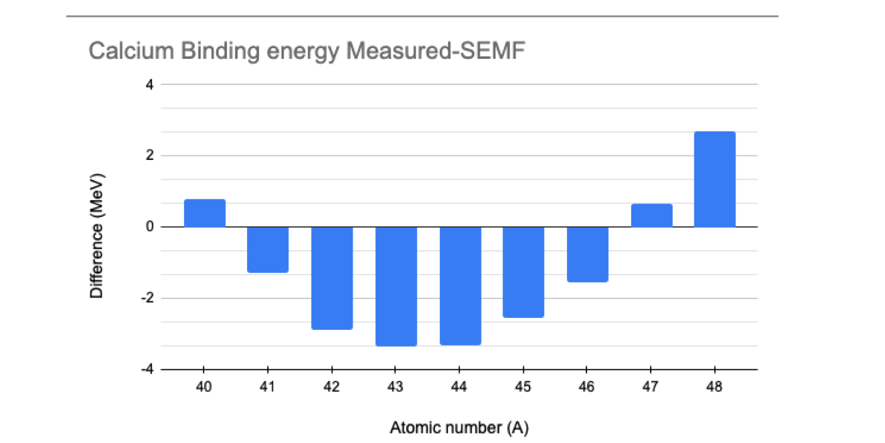

(unit3:problems)=
# Unit 3 : Worked Problems

(unit3:problem:example1)=
## 3.1 Example. Binding energy of 48-Ca

Evaluate the binding energy of 48-Ca using the SEMF and compare with the measured value.  
(The mass of 48-Ca is 47.9525229 u)

```{admonition} Solution
:class: note, dropdown
48-Ca is made of 20 protons and 28 neutrons and is an isotope with a very long lifetime of about 6.4×10$^{19}$ years.  
It is unusually neutron-rich for such a light nucleus. It is a double-magic isotope, having a magic number of both protons and neutrons and hence a large binding energy.

The measured binding energy is given by the mass difference between its constituents and the mass of the isotope:

$$
B(48, 20) = 20 \times (m_p + m_e) + 28 \times m_n - M(48, 20) = 416.00 \text{ MeV}
$$

The SEMF can be used to calculate the binding energy value as $\approx 413.28$ MeV.  
Therefore, the SEMF underestimates the binding energy by 2.72 MeV.  
E.g. the nucleus is more "bound" than the model would tell us due to the fact that all the shells are complete.

We can repeat the same calculation for other Calcium isotopes and plot the difference between the measured (experimental) value of the binding energy and the value calculated using the SEMF as a function of the atomic number $ A $.  We observe how the double magic number affects the results.



```

## 3.2 Example Spectroscopic notation

In nuclear physics, we use the same spectroscopic notation used in atomic physics.  
In atomic physics, electrons are placed in shells identified by:

| Quantum number | Symbol | Value |
|---------------|--------|-------|
| $ n $  | Principal quantum number | Any integer $ n > 0 $ |
| $ \ell $ | Orbital quantum number | Integer up to $ n - 1 $ (in atomic physics) |
| $ m_{\ell} $ | Magnetic quantum number | Integer from $ -\ell $ and $ \ell $ |
| $ m_s $ | Spin quantum number | $ \pm 1/2 $ |

In the spectroscopic notation, rather than the number $ \ell $, we use a "name" for orbital corresponding to the orbital quantum number, as:

| Orbital | $ \ell $ | $ m $ values |
|---------|----------|----------------|
| s (sharp) | 0 | 0 |
| p (principal) | 1 | -1, 0, 1 |
| d (diffuse) | 2 | -2, -1, 0, 1, 2 |
| f (fundamental) | 3 | -3, -2, -1, 0, 1, 2, 3 |
| g | 4 | -4, ... 4 |
| h | 5 | -5, ... 5 |

As an example in atomic physics, the electron configuration of $ Na $ ($ Z = 11 $) is written as:

$$
1s^2 2s^2 2p^6 3s^1
$$

to indicate how many electrons are present in each of the shells.

In nuclear physics, the same convention is used with two major differences:

- The limitation for $ \ell < n - 1 $ is no longer in place. Such limitation derives from the solution of the Schrödinger equation for a central potential.
- As we will see later, the interaction between the spin and angular momenta break the degeneracy between levels and further complicates the model.


## 3.3 Example : Adding spin and orbit angular momenta

Explain how spin and orbital angular momenta add together to form the range of spin states $J$ in the nucleus.

```{admonition} Solution
:class: note, dropdown
Let us consider the angular momentum operator $ \vec{L} $ and the spin operator $ \vec{S} $. Any given quantum state can be expressed as a sum of eigenstates of the two operators.  

For simplicity, let us consider the case when the orbital quantum number is $ \ell = 1 $ and the spin is $ 1/2 $. We can generalize later for different values of $ \ell $.

Since the operators $ \vec{L} $ and $ \vec{S} $ are independent, there will be 6 different eigenstates for different combinations of $ m_{\ell} $ and $ m_s $, e.g. there are 6 states indicated by $ |m_{\ell}, m_s \rangle $:

$$
|+1, +1/2 \rangle \quad |+1, -1/2 \rangle
$$

$$
|0, +1/2 \rangle \quad |0, -1/2 \rangle
$$

$$
|-1, +1/2 \rangle \quad |-1, -1/2 \rangle
$$

A quantum state can also be written as a sum of eigenstates of the combined operator $ \vec{J} = \vec{L} + \vec{S} $. Quantum mechanics rules tell us that the total angular momentum quantum numbers will be in the range:

$$
|\ell - s| < j < \ell + s,
$$

which in this case means there will be states with two different angular momentum quantum states:

$$
j_1 = 3/2 \quad \text{and} \quad j_2 = 1/2,
$$

leading again to 6 different eigenstates of the operator $ \vec{J} $ written as $ |j, m_j \rangle $:

$$
|3/2, 3/2 \rangle \quad |3/2, 1/2 \rangle \quad |3/2, -1/2 \rangle \quad |3/2, -3/2 \rangle
$$

$$
|1/2, 1/2 \rangle \quad |1/2, -1/2 \rangle
$$

Due to the spin-orbit interaction term in the nuclear potential (see later), these states correspond to different energy levels.

Returning to the spectroscopic notation, this implies that the 6 $ p $ levels will split into 4 $ p_{3/2} $ levels and 2 $ p_{1/2} $ levels. Similarly:

- 2 $ s $ levels corresponding to $ \ell = 0 $ will give 2 $ s_{1/2} $ levels.
- 6 $ p $ levels corresponding to $ \ell = 1 $ will give 2 $ p_{1/2} $ levels and 4 $ p_{3/2} $ levels.
- 10 $ d $ levels corresponding to $ \ell = 2 $ will give 4 $ d_{3/2} $ levels and 6 $ d_{5/2} $ levels.
- etc...

```

## 3.4 Example : Spin-orbit potential

By considering the spin orbit potential $V_{\ell s}(r) \vec{L} \cdot \vec{S}$, derive the energy shift expected for stretched and jackknife states.

```{admonition} Solution
:class: note, dropdown
We evaluate the spin-orbit term of the nuclear potential for states with different quantum number $ j $.

The spin-orbit potential is written as:

$$
V_{\ell s}(r) \vec{L} \cdot \vec{S}
$$

To evaluate it we write $ |\vec{J}|^2 $:

$$
|\vec{J}|^2 = |\vec{L} + \vec{S}|^2 = |\vec{L}|^2 + |\vec{S}|^2 + 2\vec{L} \cdot \vec{S}
$$

Hence,

$$
\vec{L} \cdot \vec{S} = \frac{1}{2} \left[ |\vec{J}|^2 - |\vec{L}|^2 - |\vec{S}|^2 \right]
$$

If we combine eigenstates with orbital momentum $ \ell $ with a spin $ 1/2 $, we obtain eigenstates of $ \vec{J} $ with quantum numbers $ \ell - 1/2 $ and $ \ell + 1/2 $ (or only $ 1/2 $ if $ \ell = 0 $).

Therefore, the expectation value of $ \vec{L} \cdot \vec{S} $ is:

$$
\langle \ell s \rangle = \frac{1}{2} \left[ \langle |\vec{J}|^2 \rangle - \langle |\vec{L}|^2 \rangle - \langle |\vec{S}|^2 \rangle \right]
$$

$$
\langle \ell s \rangle = \frac{\hbar^2}{2} \left[ j(j + 1) - \ell(\ell + 1) - s(s + 1) \right]
$$

- **For $ j = \ell + 1/2 $ we have:**

$$
\langle \ell s \rangle = \frac{\hbar^2}{2} \left[ \left( \ell + \frac{1}{2} \right) \left( \ell + \frac{3}{2} \right) - \ell(\ell + 1) - \frac{3}{4} \right] = \hbar^2 \frac{\ell}{2}
$$

- **For $ j = \ell - 1/2 $ we have:**

$$
\langle \ell s \rangle = \frac{\hbar^2}{2} \left[ \left( \ell - \frac{1}{2} \right) \left( \ell + \frac{1}{2} \right) - \ell(\ell + 1) - \frac{3}{4} \right] = -\hbar^2 \frac{\ell + 1}{2}
$$

Experimentally, we observe the term $ V_{\ell s}(r) $ to be negative, which means that the level corresponding to $ j = \ell - 1/2 $ has a higher energy than the one corresponding to $ j = \ell + 1/2 $, as seen in the next example.

```

## 3.5 Example. Nuclear levels of 93-Nb and 33-S
What are the configurations of the ground states of the nuclei 93-Nb and 33-S?
We use the energy level diagram to fill the levels independently for protons and neutrons.


```{admonition} Solution
:class: note, dropdown
**Sulfur** $^{33}_{16}S$

This isotope of sulfur has 16 protons ($Z = 16$) and 17 neutrons ($N = 17$). We use the diagram to establish the level for the **protons** as:

$$
(1s_{1/2})^2 (1p_{3/2})^4 (1p_{1/2})^2 (1d_{5/2})^6 (2s_{1/2})^2
$$

and for the **neutrons**:

$$
(1s_{1/2})^2 (1p_{3/2})^4 (1p_{1/2})^2 (1d_{5/2})^6 (2s_{1/2})^2 (1d_{3/2})^1
$$

---


**Niobium** $^{93}_{41}S$

This isotope of Niobium has 41 protons ($Z = 41$) and 52 neutrons ($N = 52$). We use the diagram to establish the level for the **protons**:

$$
(1s_{1/2})^2 (1p_{3/2})^4 (1p_{1/2})^2 (1d_{5/2})^6 (2s_{1/2})^2 (1d_{3/2})^4 (1f_{7/2})^8 (2p_{3/2})^4 (1f_{5/2})^6 (2p_{1/2})^2 (1g_{9/2})^1
$$

and for the **neutrons**:

$$
(1s_{1/2})^2 (1p_{3/2})^4 (1p_{1/2})^2 (1d_{5/2})^6 (2s_{1/2})^2 (1d_{3/2})^4 (1f_{7/2})^8 (2p_{3/2})^4 (1f_{5/2})^6 (2p_{1/2})^2 (1g_{9/2})^{10} (2d_{5/2})^2
$$

```