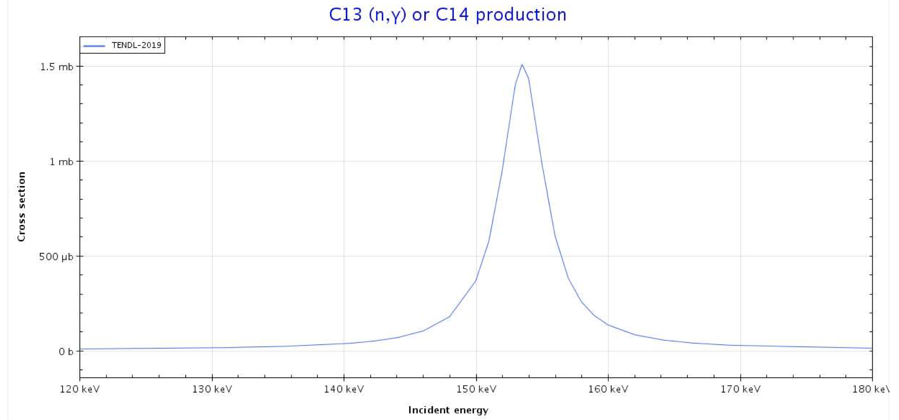

(unit8:additionalproblems)=
# Unit 8 : Additional Problems

For those looking for additional problems outside of past exam questions and the worked problems in the lectures please consider the following in the reading list.

## Unworked Problem : Thermal Neutrons

**Thermal neutrons have energies of order $ 0.025 \, \text{eV} $. If a target is irradiated by such neutrons, are the resulting reactions likely to be direct or compound-nucleus? Explain your reasoning.**

### Unworked Problem : Independence Hypothesis

**A study of the independence hypothesis compares the reactions $ ^{46}Ti(\alpha, pn)^{48}V $, $ ^{34}S(^{16}O, pn)^{48}V $, and $ ^{28}Si(^{22}Ne, pn)^{48}V $:**

1. Based on compound-nucleus theory, what do you expect this study to find?
2. The cross section for $ ^{46}Ti(\alpha, pn)^{48}V $ peaks at an $ \alpha $-kinetic energy of $ 32 \, \text{MeV} $ (in the lab frame). At what $ ^{16}O $ and $ ^{22}Ne $ kinetic energies would you expect the other two cross sections to peak, based on your answer to part (a)?
3. The magnitude of the cross section for $ ^{46}Ti(\alpha, pn)^{48}V $ is found to be much higher than for $ ^{34}S(^{16}O, pn)^{48}V $. Does this invalidate compound-nucleus theory? Explain your reasoning. (*Hint: consider the charges of the nuclei involved in the reactions.*)

### Unworked Problem : Reaction Resonances

**The diagram shows a resonance in the reaction $ ^{13}C(n, \gamma)^{14}C $:**

1. Calculate the momentum of the neutron at the peak of the resonance. (*Hint: recall that a neutron with a kinetic energy of order $ 150 \, \text{keV} $ is not relativistic.*)
2. Hence calculate the kinetic energy of the $ ^{14}C $ nucleus after the collision (but before the $ \gamma $-emission).
3. Determine the energy of the excited state corresponding to this resonance. Compare your answer with the known energy levels of $ ^{14}C $ (see, for example, the Triangle Universities Nuclear Laboratory website).
4. Estimate the lifetime of this state.

**Relevant atomic masses:**
- $ ^{13}C: 13.0033548 \, u $
- $ ^{14}C: 14.0032420 \, u $
- $ n: 1.0086650 \, u $
- $ 1 \, u = 931.502 \, \text{MeV/c}^2 $

### Unworked Problem : Momentum Transfer

**A $ (d, p) $ scattering experiment on a $ ^{40}Ca $ target (i.e. $ ^{40}Ca(d, p)^{41}Ca $) finds a peak in the proton energy spectrum at a proton energy of $ 10.29 \, \text{MeV} $, measured at an angle of $ 67.5^\circ $ (in the lab frame) to the initial deuteron direction. The energy of the deuteron beam is $ 7.00 \, \text{MeV} $:**

1. Find the momenta of the incident deuteron and outgoing proton.
2. Show that, assuming that the target $ ^{40}Ca $ atom is stationary, the momentum of the $ ^{41}Ca $ atom is given by:

   $$
   p_{Ca}^2 = p_d^2 + p_p^2 - 2 p_d p_p \cos \theta
   $$

   where $ \theta $ is the angle between the incoming deuteron and outgoing proton directions, i.e., $ 67.5^\circ $. Hence calculate the momentum and kinetic energy of the $ ^{41}Ca $ atom.
   (*Hint: draw the triangle corresponding to the conservation of momentum, $ \vec{p}_d = \vec{p}_p + \vec{p}_{Ca} $. Recall that all the particles in this reaction are non-relativistic.*)
3. Calculate the Q-value of the reaction $ ^{40}Ca(d, p)^{41}Ca $.
4. Using your answers to parts (b) and (c), calculate the energy of the excited state of $ ^{41}Ca $ that produces this peak in the proton energy spectrum.

**Relevant atomic or particle masses:**
- $ ^{40}Ca: 39.9625909 \, u $
- $ ^{41}Ca: 40.9622779 \, u $
- Deuteron: $ 2.0135532 \, u $
- Proton: $ 1.0072765 \, u $

