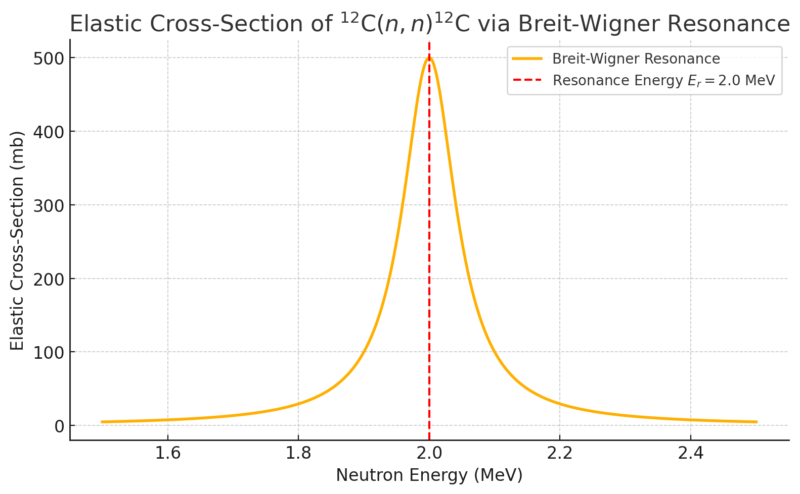

(unit8:problems)=
# Unit 8 : Worked Problems

(unit8:problem:example1)=
### Problem: Co-59 neutron cross-sections

Co-59 is a stable nucleus. The total neutron cross-section for Co-59 is $\textnormal{Co}_{59}$ for 14 MeV neutrons is $2699 \, \textnormal{mb}$. The dominant branching ratios for individual reactions contributing to the total cross-section are given below.

| Reaction | Branching Ratio |
| ---------|-----------------|
| (n,total) | 100% |
| (n,elastic) | 49.4% |
| (n,inelastic) | 20.0% |
| (n,2n) | 24.6% |
| (n,na) | 0.1% |
| (n,np) | 2.3% |
| (n,p) | 1.9% |
| (n,d) | 0.2% |
| (n,a) | 1.2% |


1. Determine the cross-sections of each individual reaction.
2. Determine the average number of final state neutrons per event that would be observed over all reactions.
3. Determine the cross-section for producing a 1-proton final state.


```{admonition} Solution
:class: note, dropdown

**Total Cross-sections**
To obtain the individual cross-sections we simply multiply the total cross-section by the branching ratio.


| Reaction | Branching Ratio | Cross-section [mb] | 
| ---------|-----------------|-------------|
| (n,total) | 100% | 2699
| (n,elastic) | 49.4% | 1333.3
| (n,inelastic) | 20.0% | 539.8
| (n,2n) | 24.6% | 663.6
| (n,na) | 0.1% | 2.7
| (n,np) | 2.3% | 62.1
| (n,p) | 1.9% |  51.3
| (n,d) | 0.2% | 5.4
| (n,a) | 1.2% | 32.4


**Average Neutrons**
To estimate the average number of neutrons we need to first determine the number of neutrons in each final state.

| Reaction | Branching Ratio | N Neutrons | 
| ---------|-----------------|-------------|
| (n,elastic) | 49.4% | 1
| (n,inelastic) | 20.0% | 1
| (n,2n) | 24.6% | 2
| (n,na) | 0.1% | 1
| (n,np) | 2.3% | 1
| (n,p) | 1.9% |  0
| (n,d) | 0.2% | 0
| (n,a) | 1.2% | 0


We then simply multiply each one by the branching ratios to estimate the average number of neutrons we would see.

$$
49.4 \cdot 1 + 20.0 \cdot 1 + 24.6 \cdot 2 + 0.1 \cdot 1 + 2.3 \cdot 1 = 121
$$

This gives an average of approximately 1.21 neutrons per reaction. If we didn't have the 2n reaction you would see this would instead be only 0.78 neutrons per reaction, but because around 25% of the time a reaction produces two neutrons, the average ends up being greater than one.


**Proton Final State Cross-section**

The only reactions contributing to the proton final state are (n,np) and (n,p). We therefore simply add both cross-sections together.

$$
51.3\,\textnormal{mb} + 62.1\,\textnormal{mb} = 113.4\,\textnormal{mb}
$$


```


### Problem: Branching Ratios for Compound Nucleus Reactions on $ ^{12}\textnormal{C} $

Consider neutron-induced reactions on carbon-12 at a neutron energy of $  E_n = 14 \, \textnormal{MeV}  $, where the compound nucleus formed is $ ^{13}\textnormal{C}^* $ in an excited state.

At this energy, the dominant reactions and their measured cross-sections are approximately:

| Reaction Channel | Reaction | Cross-section ($  \sigma  $) [mb] |
|-------------------|-----------|-----------------------------------|
| Elastic scattering | $ ^{12}\textnormal{C}(n,n)^{12}\textnormal{C} $ | 850 |
| Inelastic scattering | $ ^{12}\textnormal{C}(n,n')^{12}\textnormal{C}^* $ | 200 |
| Neutron emission | $ ^{12}\textnormal{C}(n,2n)^{11}\textnormal{C} $ | 70 |
| Proton emission | $ ^{12}\textnormal{C}(n,np)^{11}\textnormal{B} $ | 20 |
| Alpha emission | $ ^{12}\textnormal{C}(n,n\alpha)^{8}\textnormal{Be} $ | 10 |

---

1. Calculate the total reaction cross-section $  \sigma_\textnormal{total}  $ by summing all the reaction cross-sections.

2. Compute the **branching ratio** for each reaction channel, defined as:

   $$
   B_i = \frac{\sigma_i}{\sigma_\textnormal{total}}
   $$

   Express your answer in percentages.

3. Which decay channel is dominant, and what is the probability (%) that the compound nucleus will de-excite via proton emission?

---


```{admonition} Solution
:class: note, dropdown

1. **Total cross-section**:

   $$
   \sigma_\textnormal{total} = 850 + 200 + 70 + 20 + 10 = 1150 \, \textnormal{mb}
   $$

2. **Branching Ratios**:

   - Elastic: $  B = \frac{850}{1150} \approx 73.9\%  $
   - Inelastic: $  B = \frac{200}{1150} \approx 17.4\%  $
   - $  (n,2n)  $: $  B = \frac{70}{1150} \approx 6.1\%  $
   - $  (np)  $: $  B = \frac{20}{1150} \approx 1.7\%  $
   - $  (n\alpha)  $: $  B = \frac{10}{1150} \approx 0.9\%  $

3. **Dominant channel**: Elastic scattering dominates with ~74%.

   **Probability of proton emission**:

   $$
   1.7\%
   $$

```


### Problem: Resonance Contribution via Breit-Wigner Formula

In addition to the direct reaction channels, suppose that near $  E_n = 2.0\,\textnormal{MeV}  $, the $ ^{12}\textnormal{C}(n,n) $ elastic cross-section shows a prominent isolated resonance due to a $ ^{13}\textnormal{C}^* $ compound nucleus state.



You are given:
- Resonance energy: $  E_r = 2.0\,\textnormal{MeV}  $
- Neutron width: $  \Gamma_n = 0.050\,\textnormal{MeV}  $
- Total width: $  \Gamma = 0.10\,\textnormal{MeV}  $
- Resonance peak cross-section: $  \sigma_{\textnormal{max}} = 500\,\textnormal{mb}  $
  
The cross-section for elastic scattering near the resonance is described by the **single-level Breit-Wigner formula**:

$$
\sigma(E) = \sigma_{\textnormal{max}} \cdot \frac{\Gamma_n^2}{(E - E_r)^2 + \left( \frac{\Gamma}{2} \right)^2}
$$

---


1. **Calculate** the elastic scattering cross-section at $  E = 2.1\,\textnormal{MeV}  $ using the Breit-Wigner formula.

2. **Discuss** how this resonance affects the elastic scattering branching ratio if the neutron energy is close to $  2.0\,\textnormal{MeV}  $ instead of $ 14\,\textnormal{MeV} $ as in the first part.

---


```{admonition} Solution
:class: note, dropdown

1. **Breit-Wigner cross-section at $  E = 2.1\,\textnormal{MeV}  $:**

$$
\sigma(2.1) = 500 \cdot \frac{(0.050)^2}{(2.1 - 2.0)^2 + (0.05)^2} \, \textnormal{mb}
$$

$$
= 500 \cdot \frac{0.0025}{0.01 + 0.0025}
$$

$$
= 500 \cdot \frac{0.0025}{0.0125} = 500 \cdot 0.2 = 100\,\textnormal{mb}
$$

So, at $ 2.1\,\textnormal{MeV} $ the cross-section is reduced to **100 mb** due to being off-resonance.


2. **Discussion**:

When the neutron energy is near $  E_r = 2.0\,\textnormal{MeV}  $, the elastic scattering cross-section is strongly enhanced due to the resonance (up to 500 mb instead of ~100 mb off-resonance). 

As a result, the **branching ratio** for elastic scattering would increase significantly at $  E_n \approx 2\,\textnormal{MeV}  $ because the resonance enhances $  \sigma_{(n,n)}  $ while other channels ($  (n,n')  $, $  (n,2n)  $, etc.) do not exhibit such a strong resonance at this energy.


```

<!-- 
## Worked Example: Neutron-Induced Fission of $ ^{235}U $

A possible reaction for the neutron-induced fission of $ ^{235}U $ is:


$$
 ^{235}_{92}U + n \to ^{139}_{52}Te + ^{94}_{40}Zr + X 
 $$


1. What is $ X $?
2. How much energy is released in this process?
3. Considering that $ ^{94}_{40}Zr $ is stable, but the stable isobar with $ A = 139 $ is $ ^{139}_{57}La $, how much additional energy is released by the decay of $ ^{139}_{52}Te $? If this takes place in a nuclear reactor, is this additional energy a useful contribution to the reactor's power output?
4. Using the Semi-Empirical Mass Formula (SEMF), which isobar with $ A = 139 $ would you expect to be stable? If it is not $ ^{139}_{57}La $, explain the apparent discrepancy.

Masses:
- $ ^{235}U $: 235.04393 u
- $ ^{139}Te $: 138.93473 u
- $ ^{94}Zr $: 93.90632 u
- $ ^{139}La $: 138.90635 u
- $ n $: 1.00866 u
- $ e^- $: 0.00055 u

SEMF coefficients:
- $ a_v = 15.5 \, MeV $
- $ a_s = 16.8 \, MeV $
- $ a_c = 0.72 \, MeV $
- $ a_a = 23.0 \, MeV $.

```{admonition} Solution
:class: note, dropdown

1. **What is $ X $?**  
   The total $ A $ is 236, and the total $ Z $ is 92. Accounting for all protons and neutrons, $ X $ is **3 neutrons**.

2. **Energy Released**:  
   Using atomic masses, $ Q = 235.04393 + 1.00866 - (138.93473 + 93.90632 + 3 \times 1.00866) = 0.18556 \, u $,  
   which converts to $ 172.85 \, MeV $.

3. **Additional Energy**:  
   $ ^{139}_{52}Te $ decays to $ ^{139}_{57}La $ via five $ \beta^- $ decays.  
   $ Q = 138.93473 - 138.90635 = 0.02838 \, u = 26.44 \, MeV $.  
   About half of this energy is useful (the rest is carried by neutrinos).

4. **Stable Isobar Prediction**:  
   Using SEMF, the isobar predicted is $ Z = 58.3 $. However, the shell model prefers $ Z = 57 $ because $ 139 - 57 = 82 $, a magic number.

``` 
-->

<!-- 
## Worked Example: Proton-Boron Fusion Reaction

The reaction $ p + ^{11}B \to 3\alpha $ is sometimes considered for commercial fusion. Its advantages include all charged products and $ ^{11}B $ being stable and abundant (80% of natural boron). 

1. What is the $ Q $-value of this reaction?
2. What is the Gamow energy for this reaction?
3. Compare the Gamow energy for this reaction with that of d-t fusion.
4. Explain, as quantitatively as possible, why this reaction is unlikely to be used in commercial fusion reactors in the foreseeable future.

Relevant atomic mass:
- $ ^{11}B $: 11.0093052 u

Relevant particle masses:
- Proton ($ p $): 1.0072765 u
- Neutron ($ n $): 1.0086649 u
- Deuterium ($ d $): 2.0135532 u
- Tritium ($ t $): 3.0155007 u
- Alpha particle ($ \alpha $): 4.0015062 u.

```{admonition} Solution
:class: note, dropdown

1. **Q-Value**:  
   Using nuclear masses: $ Q = 11.0065622 + 1.0072765 - 3 \times 4.0015062 = 0.0093201 \, u = 8.68 \, MeV $.

2. **Gamow Energy**:  
   Reduced mass = $ 0.922823 \, u = 859.6 \, MeV $.  
   Gamow energy = $ 22.6 \, MeV $.

3. **Comparison with d-t Fusion**:  
   Gamow energy for d-t fusion = $ 1.18 \, MeV $, which is significantly lower than $ 22.6 \, MeV $.

4. **Feasibility**:  
   The required temperature for $ p + ^{11}B $ fusion is about 10× higher than for d-t fusion, making it impractical for current commercial reactors.

``` -->
 
<!-- 


## Worked Example : Resonance in Neutron Cross-Section of $ ^{63}_{29}Cu $

The plot shows a resonance in the cross-section of neutrons incident on $ ^{63}_{29}Cu $. Calculate:

1. The branching fraction of the (n,γ) reaction.
2. The energy of the excited state.
3. The lifetime of the excited state.

Why is the line shape for (n, elastic) different from (n,γ)?

Atomic masses:
- $ ^{63}Cu $: 62.9295975 u
- $ ^{64}Cu $: 63.9297642 u
- $ n $: 1.0086649 u

Conversion: $ 1 u = 931.49 \, MeV $.

```{admonition} Solution
:class: note, dropdown


1. **Branching Fraction**: The branching fraction varies with energy. Using a reasonable approximation, the ratio of peak heights is 0.45.

2. **Energy of the Excited State**:  
   Using $ Q = m_i - m_f $,  
   $ Q = 0.0084982 \, u $ or $ 7.9160 \, MeV $.  
   Adding the neutron kinetic energy yields $ 7.9166 \, MeV $.

3. **Lifetime of the Excited State**:  
   The full width at half height is $ \Gamma = 2.3 \, eV $. Using the uncertainty principle $ \Gamma \tau \approx \hbar $,  
   $ \tau = \frac{1.05 \times 10^{-34}}{2.3 \times 1.6 \times 10^{-19}} = 2.9 \times 10^{-16} \, s $.

4. **Line Shape Difference**: The elastic scattering cross-section is affected by interference between direct and compound-nucleus components, while (n,γ) must occur via a compound nucleus.

```  -->